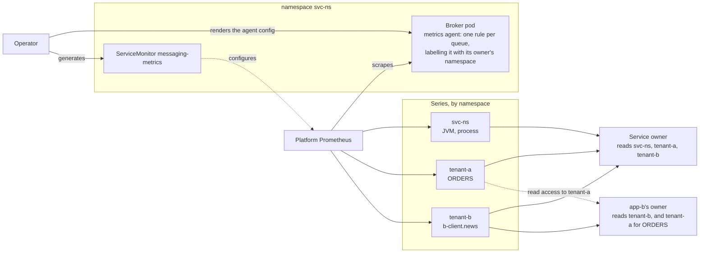

# Cross-namespace Prometheus scraping

## Problem

A BrokerApp can bind to a BrokerService in another namespace, and that is the
case multi-tenancy rests on. Prometheus grants access to metrics per namespace,
so an app's metrics are private to it only when its series are labelled with a
namespace of its own.

The broker lives in the service's namespace, while each app's queue metrics
have to be readable from the app's namespace. The scrape wiring has to bridge
that on every cluster the operator supports, OpenShift included, where:

- user workload monitoring serves `ServiceMonitor`, `PodMonitor` and `Probe`,
  but not `ScrapeConfig`, and enforces `ignoreNamespaceSelectors: true` and
  `enforcedNamespaceLabel: namespace`: a series always carries the namespace of
  the object that declared its scrape;
- platform monitoring (`openshift-monitoring/prometheus-k8s`) watches the
  namespaces labelled `openshift.io/cluster-monitoring=true`, does not enforce a
  namespace label, and the tenancy-aware Thanos query endpoint serves its
  series alongside user workload monitoring's, filtered by namespace.

## Decision: label each queue with its owner's namespace

In this example `app-a`, in `tenant-a`, owns the anycast queue `ORDERS` and the
topic `NEWS`. `app-b`, in `tenant-b`, consumes from `ORDERS` and subscribes to
`NEWS` with its own queue `b-client.news`. Each queue is filed once, in its
owner's namespace; who else reads it is a matter of access to that namespace.

The BrokerService generates one `ServiceMonitor`, in its own namespace, named
`<service>-metrics`. It selects the service's `Service` on its `metrics` port
(`8888`), scrapes over mTLS as the prometheus identity, which the broker grants
the broad `metrics` role, and sets `honorLabels: true`.

Messages only live in queues, so metrics are per queue. An anycast queue shares
its address's name; a subscription queue is bound to a multicast address, which
holds no messages and has no metrics of its own. Totals for a multicast address
are an aggregation over its subscription queues, which carry the address as a
label.

The operator already renders the broker's exporter configuration from the queues
its apps declare. Each of those queues gets a rule of its own, ahead of the
generic one, that labels its series with `namespace` and `brokerapp` of the app
that owns it:

- an anycast queue belongs to the app that declares the address. Apps that
  produce to it or consume from it name that app in their `AddressRef`;
- a subscription queue belongs to the app that declares the subscription, the
  consumer. The app that owns the multicast address does not own it, and does
  not see it in its own namespace. A second app declaring the same subscription
  on the same address is rejected, so a subscription queue has one owner;
  sharing one between apps is not modelled yet.

Broker-wide series, JVM and process, match no per-queue rule and keep the
service's namespace. With `honorLabels`, a Prometheus that does not enforce its
own namespace label files every app queue in its app's namespace and everything
else in the service's. Whoever may read metrics in a namespace then reads that
namespace's queues, provided queries go through something that enforces the
namespace.

This mirrors how kube-state-metrics serves every namespace from one target, and
is the pattern the OpenShift monitoring team pointed to. It was verified on
OpenShift 4.22 and on kube-prometheus-stack, from a tenant restricted to its own
namespace: its queue series are visible, the service's are not, a `namespace`
matcher naming another namespace returns nothing of it, and a `PrometheusRule`
in the tenant's namespace fires on the queue series.

### Who reads what

Each queue is filed once, in its owner's namespace. Reading a queue from
elsewhere is a matter of read access to metrics in the owner's namespace:

- the service owner reads the service's namespace for the broker-wide series,
  and every namespace whose apps may bind to the service for their queues. The
  BrokerService lists the apps applied to it in `status.provisionedApps`, each
  as `<namespace>/<name>@<generation>`, so which namespaces to read needs no
  cluster-wide listing;
- an app's owner reads its own namespace, and for a queue owned by another app
  it references, that app's namespace;
- a subscription queue is its subscriber's, so an app publishing to a topic
  reads its subscribers' namespaces to see their backlog.

### Platform requirements

**OpenShift.** The scrape has to be done by platform monitoring, since user
workload monitoring overrides the namespace label. OpenShift reserves platform
monitoring for its core components and Red Hat certified operators, which the
operator's certified build is; the monitoring team confirmed this use falls
within it ([collecting metrics with the platform Prometheus][ocp-platform]):

- the BrokerService's namespace is labelled
  `openshift.io/cluster-monitoring=true`. User workload monitoring then ignores
  that namespace entirely, so it should hold BrokerServices and nothing a
  tenant expects to monitor itself;
- `openshift-monitoring/prometheus-k8s` may get, list and watch `services`,
  `endpoints`, `endpointslices` and `pods` there;
- tenants have no write access there: a monitoring object in a platform
  namespace can label series with any namespace.

User workload monitoring is not needed for the scrape nor for reading its
series, which the tenancy-aware query endpoint serves from platform
monitoring. It is needed for tenants' `PrometheusRule`s, evaluated by its
Thanos Ruler, and for any scrape a tenant declares itself, such as one
presenting its app certificate.

**Other clusters.** A Prometheus selects the generated ServiceMonitor by
`broker.arkmq.org/monitoring: "true"`. Isolation between tenants needs a query
path that enforces the namespace, which Prometheus alone does not provide: the
recommendation is the arrangement OpenShift uses, kube-rbac-proxy and
prom-label-proxy in front of Prometheus or Thanos. A Prometheus running with
`enforcedNamespaceLabel` is not supported: it files every queue in the service's
namespace.

### An app's own identity stays

Independently of the generated scrape, the broker keeps granting each app's
certificate its own role on the metrics endpoint, which reads the queues the app
is authorised on and nothing else. The operator generates nothing for it; it is
there for a scrape a tenant declares, typically a `Probe` in its own namespace
presenting its app certificate, as the previous design did (option A below).

It covers what labels cannot:

- **A tenant's own scraper.** A Prometheus of the tenant's, or an agent
  shipping metrics outside the cluster, reads the tenant's queues without the
  prometheus identity, which sees every tenant's.
- **No prometheus-operator.** The operator generates no scrape at all, and
  this is the only tenant-scoped route to the queues.
- **No namespace enforcing query path.** Labels place series; they isolate
  nothing unless queries are filtered by namespace. Where they are not, the
  certificate is the only boundary.
- **Scrape-time namespace enforcement.** Where a Prometheus overrides the
  namespace label, as OpenShift's user workload monitoring does, a tenant's own
  scrape lands in the tenant's namespace by construction.

It leaks one thing the labelled scrape does not. The role scopes queue series,
but the JVM and process series come from the metrics agent's own collectors,
not from broker MBeans, so every identity that can scrape the endpoint gets
them. They are the shared broker's heap, threads, garbage collection and CPU:
no tenant's data, but a side channel on the load all tenants put on the broker.
The metrics agent the broker image ships, jmx_exporter 1.2.0, has no setting to
turn these collectors off; closing this means a later agent in the broker
image. The service owner would then lose them too.

### Queues the operator does not know

Only queues the apps declare are labelled. Auto-creation is disabled, so this
covers every queue an app is authorised to use, except those an MQTT client
creates for undeclared subscriptions: those keep the service's namespace. MQTT
clients should use a naming prefix per app, so such queues remain attributable.

### Caveats

- The labels are only as right as the operator's ownership records. Nothing
  cross-checks them at runtime; the end-to-end suite asserts that each app's
  queue lands in its app's namespace and no other.
- Read access is per namespace. An app's owner allowed to read a queue it
  consumes from another app's namespace reads everything else filed there too.

## Options considered

### A. A Probe per app, scraping under the app's certificate

The previous design. Every service and every app got a `Probe` in its own
namespace, whose prober URL was the broker pod itself; each app's scrape
presented the app's certificate, which the broker mapped to a per-app metrics
role that only sees that app's queues. Series carried the namespace of the
Probe that collected them, which user workload monitoring enforces.

**Replaced as the generated default:** it drives `Probe`, a blackbox-exporter
kind, off-label, relying on how prometheus-operator renders one; it scrapes the
broker once per app plus once for the service; and since the per-app role only
filters queue series, every tenant also received the shared broker's JVM and
process series. The per-app identity it relied on is kept, so a tenant can
still declare such a scrape where it needs one.

### B. ScrapeConfig

**Rejected:** OpenShift does not serve it, and it is `v1alpha1`.

### C. Cross-namespace namespaceSelector on a ServiceMonitor

**Rejected:** OpenShift's Cluster Monitoring Operator enforces
`ignoreNamespaceSelectors: true` on user workload monitoring.

### D. Selectorless Service with operator-managed Endpoints

**Rejected:** OpenShift's `RestrictedEndpointsAdmission` refuses Endpoints
pointing into the pod network without a cluster-wide `endpoints/restricted`
grant, and pod IPs go stale.

### E. A proxy pod in each app's namespace

**Rejected:** a workload to run in every tenant namespace, and one more
component on the scrape path.

### F. A copy of each queue for the service and for the namespaces using it

The ServiceMonitor would scrape the broker once per namespace it files into:
every queue again in the service's namespace, and each shared queue again in the
namespaces of the apps producing to or consuming from it, told apart by a view
label. Verified on OpenShift 4.22 and kube-prometheus-stack.

**Set aside:** it duplicates tenant data into other namespaces, multiplies
scrapes and series, and makes every aggregation filter on the view label to
count a queue once. Access to the owner's namespace already expresses who may
read a queue.

## References

- [prometheus-operator: ServiceMonitor][prom-sm]
- [OpenShift: enabling monitoring for user-defined projects][ocp-uwm]
- [OpenShift monitoring: collecting metrics with the platform Prometheus][ocp-platform]
- [prom-label-proxy][prom-label-proxy]

[prom-sm]: https://prometheus-operator.dev/docs/api-reference/api/#monitoring.coreos.com/v1.ServiceMonitor
[ocp-uwm]: https://docs.openshift.com/container-platform/latest/observability/monitoring/enabling-monitoring-for-user-defined-projects.html
[prom-label-proxy]: https://github.com/prometheus-community/prom-label-proxy
[ocp-platform]: https://rhobs-handbook.netlify.app/products/openshiftmonitoring/collecting_metrics.md/#collecting-metrics-with-prometheus
