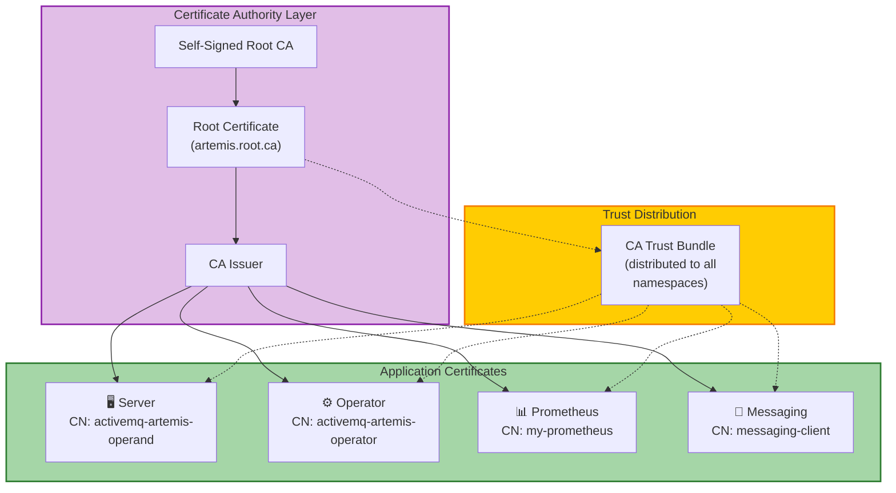
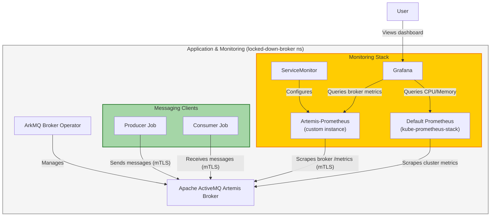
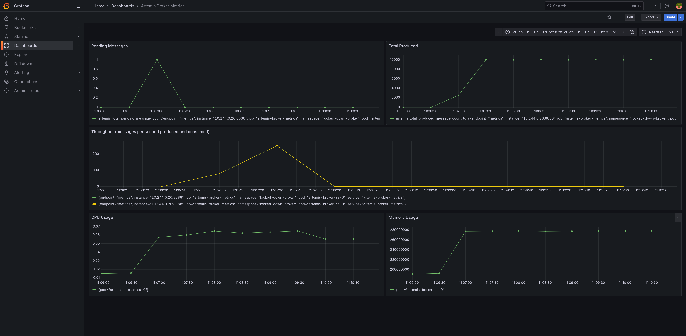

This tutorial shows how to deploy a "locked-down" [ActiveMQ
Artemis](https://activemq.apache.org/components/artemis/) broker and securely
access its Prometheus metrics endpoint from within the same Kubernetes cluster
using mutual TLS (mTLS).

**What is mTLS?** Mutual TLS means both the client and server authenticate each
other using certificates, providing stronger security than regular TLS where
only the server is authenticated.

**What is a "locked-down" broker?** A broker configured with `spec.restricted:
true` that disables anonymous access and requires certificate-based
authentication for all connections.

This tutorial covers setting up a complete secure monitoring pipeline:
installing monitoring tools and certificate management, creating a PKI (Public
Key Infrastructure - a system for managing certificates), deploying a
locked-down broker, configuring secure metrics collection, and visualizing the
results with a Grafana dashboard.

**Why do this?** In production environments, you need to monitor broker
performance and health while ensuring all communications are encrypted and
authenticated. This prevents unauthorized access to sensitive messaging data and
metrics.

A locked-down broker (`spec.restricted=true`) enhances security by disabling
anonymous access, enabling client certificate authentication, and relying on
`cert-manager` for certificate lifecycle management.

This tutorial results in a fully secured Apache ActiveMQ Artemis
broker with comprehensive monitoring, where all communication uses mutual TLS
authentication and real-time messaging metrics are observable through a
Grafana dashboard.

## Table of Contents

* [Architecture Overview](#architecture-overview)
* [Understanding the Security Model](#understanding-the-security-model)
* [Prerequisites](#prerequisites)
* [Install the dependencies](#install-the-dependencies)
* [Create Certificate Authority and Issuers](#create-certificate-authority-and-issuers)
* [Deploy the Locked-Down Broker](#deploy-the-locked-down-broker)
* [Scrape the broker](#scrape-the-broker)
* [Deploy and Configure Grafana](#deploy-and-configure-grafana)
* [Visit Grafana's dashboard](#visit-grafanas-dashboard)
* [Exchange Messages](#exchange-messages)
* [Troubleshooting](#troubleshooting)
* [Cleanup](#cleanup)
* [Conclusion](#conclusion)

## Architecture Overview

### Certificate Infrastructure

This diagram shows the PKI hierarchy and how certificates are distributed for
mTLS authentication:



### Component Interactions

This diagram shows the operational flow between components during normal
operation:



## Understanding the Security Model

The locked-down broker uses certificate-based authentication with specific naming requirements:

* **Certificate-Based Roles:** The broker grants access based on certificate
  Common Names (CN) - the "name" field in a certificate that identifies who it
  belongs to. We configure two separate authentication realms:

  **Messaging Realm (AMQPS acceptor):**
  * `CN=messaging-client` gets messaging permissions (used by producer/consumer
    jobs)

  **Control Plane Realm (HTTP/Jolokia metrics endpoint):**
  * `CN=activemq-artemis-operator` gets operator privileges (used by the
    operator for management)
  * `CN=my-prometheus` gets metrics access (used by Prometheus for scraping)
  * `CN=activemq-artemis-operand` allows health probes

* **Required Secret Names:** Kubernetes Secrets that store certificates and keys:
  * `broker-cert`: Server certificate for the broker pod (proves the broker's
    identity)
  * `activemq-artemis-manager-ca`: CA trust bundle (the "root" certificate that
    validates all others, key must be `ca.pem`)
  * `my-prometheus-cert`: Client certificate for Prometheus to authenticate with
    the metrics endpoint

These conventions ensure secure communication between all components in the
tutorial, with separate certificates for different roles following the principle
of least privilege.

## Prerequisites

Before you start, ensure you have the following tools and resources available:

### Required Tools

* **kubectl** v1.28+ - Kubernetes command-line tool
* **helm** v3.12+ - Package manager for Kubernetes
* **minikube** v1.30+ (or alternatives like [kind](https://kind.sigs.k8s.io/)
  v0.20+, [k3s](https://k3s.io/))
* **jq** - JSON processor (for extracting broker version)

### Minimum System Resources

* **CPU:** 4 cores minimum (for minikube VM + all components)
* **RAM:** 8GB minimum (minikube will use ~6GB)
* **Disk:** 20GB free space

### Kubernetes Cluster

You need access to a running Kubernetes cluster. A
[Minikube](https://minikube.sigs.k8s.io/docs/start/) instance running on your
laptop will work for this tutorial.

> ⚠️ **Production Warning**: This tutorial uses self-signed certificates suitable
> for development and testing. For production deployments, integrate with your
> organization's existing PKI infrastructure and follow your security policies.

### Start minikube

```{"stage":"init", "id":"minikube_start"}
minikube start --profile tutorialtester
minikube profile tutorialtester
kubectl config use-context tutorialtester
minikube addons enable metrics-server --profile tutorialtester
```
```shell markdown_runner
* [tutorialtester] minikube v1.36.0 on Fedora 41
* Automatically selected the kvm2 driver. Other choices: qemu2, ssh
* Starting "tutorialtester" primary control-plane node in "tutorialtester" cluster
* Creating kvm2 VM (CPUs=2, Memory=6000MB, Disk=20000MB) ...
* Preparing Kubernetes v1.33.1 on Docker 28.0.4 ...
  - Generating certificates and keys ...
  - Booting up control plane ...
  - Configuring RBAC rules ...
* Configuring bridge CNI (Container Networking Interface) ...
* Verifying Kubernetes components...
  - Using image gcr.io/k8s-minikube/storage-provisioner:v5
* Enabled addons: storage-provisioner, default-storageclass
* Done! kubectl is now configured to use "tutorialtester" cluster and "default" namespace by default
! Image was not built for the current minikube version. To resolve this you can delete and recreate your minikube cluster using the latest images. Expected minikube version: v1.35.0 -> Actual minikube version: v1.36.0
* minikube profile was successfully set to tutorialtester
Switched to context "tutorialtester".
* metrics-server is an addon maintained by Kubernetes. For any concerns contact minikube on GitHub.
You can view the list of minikube maintainers at: https://github.com/kubernetes/minikube/blob/master/OWNERS
  - Using image registry.k8s.io/metrics-server/metrics-server:v0.7.2
* The 'metrics-server' addon is enabled
```

### Enable nginx ingress for minikube

Enable SSL passthrough so that the ingress controller forwards encrypted traffic
directly to the backend services without terminating TLS at the ingress level.
This is required because our broker uses client certificate authentication (mTLS)
and needs to handle the TLS handshake itself to validate client certificates.

```{"stage":"init"}
minikube addons enable ingress
minikube kubectl -- patch deployment -n ingress-nginx ingress-nginx-controller --type='json' -p='[{"op": "add", "path": "/spec/template/spec/containers/0/args/-", "value":"--enable-ssl-passthrough"}]'
```
```shell markdown_runner
* ingress is an addon maintained by Kubernetes. For any concerns contact minikube on GitHub.
You can view the list of minikube maintainers at: https://github.com/kubernetes/minikube/blob/master/OWNERS
  - Using image registry.k8s.io/ingress-nginx/controller:v1.12.2
  - Using image registry.k8s.io/ingress-nginx/kube-webhook-certgen:v1.5.3
  - Using image registry.k8s.io/ingress-nginx/kube-webhook-certgen:v1.5.3
* Verifying ingress addon...
* The 'ingress' addon is enabled
deployment.apps/ingress-nginx-controller patched
```

### Get minikube's IP

This will be used later to construct the Ingress hostname.

```{"stage":"init", "runtime":"bash", "label":"get the cluster ip"}
export CLUSTER_IP=$(minikube ip --profile tutorialtester)
```

### Create the namespace

All resources for this tutorial will be created in the `locked-down-broker` namespace.

```{"stage":"init", "runtime":"bash", "label":"create the namespace"}
kubectl create namespace locked-down-broker
kubectl config set-context --current --namespace=locked-down-broker
until kubectl get serviceaccount default -n locked-down-broker &> /dev/null; do sleep 1; done
```
```shell markdown_runner
namespace/locked-down-broker created
Context "tutorialtester" modified.
```

### Deploy the Operator

Go to the root of the operator repo and install it into the `locked-down-broker`
namespace.

```{"stage":"init", "rootdir":"$initial_dir"}
./deploy/install_opr.sh
```
```shell markdown_runner
Deploying operator to watch single namespace
Client Version: 4.18.5
Kustomize Version: v5.4.2
Kubernetes Version: v1.33.1
customresourcedefinition.apiextensions.k8s.io/activemqartemises.broker.amq.io created
customresourcedefinition.apiextensions.k8s.io/activemqartemisaddresses.broker.amq.io created
customresourcedefinition.apiextensions.k8s.io/activemqartemisscaledowns.broker.amq.io created
customresourcedefinition.apiextensions.k8s.io/activemqartemissecurities.broker.amq.io created
serviceaccount/activemq-artemis-controller-manager created
role.rbac.authorization.k8s.io/activemq-artemis-operator-role created
rolebinding.rbac.authorization.k8s.io/activemq-artemis-operator-rolebinding created
role.rbac.authorization.k8s.io/activemq-artemis-leader-election-role created
rolebinding.rbac.authorization.k8s.io/activemq-artemis-leader-election-rolebinding created
deployment.apps/activemq-artemis-controller-manager created
```

Wait for the Operator to start (status: `running`).

```{"stage":"init", "label":"wait for the operator to be running"}
kubectl wait pod --all --for=condition=Ready --namespace=locked-down-broker --timeout=600s
```
```shell markdown_runner
pod/activemq-artemis-controller-manager-7f55767d45-772b9 condition met
```

## Install the dependencies

### Install Prometheus Operator

Before setting up the certificate infrastructure, install the Prometheus
Operator. The `kube-prometheus-stack` includes Prometheus, Grafana, and related
monitoring components.

The Helm flags configure the stack for our tutorial environment:
* `grafana.sidecar.*`: Enables automatic discovery of dashboards and datasources
  from ConfigMaps
* `kube*.enabled=false`: Disables some cluster component monitoring (etcd,
  controller-manager, scheduler)

This installs both a default Prometheus instance (for cluster/pod metrics) and
Grafana. We'll create a second custom Prometheus instance specifically for
scraping the locked-down broker with mTLS.

```{"stage":"init", "runtime":"bash", "label":"install the prometheus operator"}
helm repo add prometheus-community https://prometheus-community.github.io/helm-charts
helm upgrade -i prometheus prometheus-community/kube-prometheus-stack \
  -n locked-down-broker \
  --set grafana.sidecar.dashboards.namespace=ALL \
  --set grafana.sidecar.dashboards.enabled=true \
  --set grafana.sidecar.datasources.enabled=true \
  --set grafana.sidecar.datasources.label=grafana_datasource \
  --set kubeEtcd.enabled=false \
  --set kubeControllerManager.enabled=false \
  --set kubeScheduler.enabled=false \
  --wait
```
```shell markdown_runner
"prometheus-community" already exists with the same configuration, skipping
Release "prometheus" does not exist. Installing it now.
NAME: prometheus
LAST DEPLOYED: Thu Oct  2 16:24:02 2025
NAMESPACE: locked-down-broker
STATUS: deployed
REVISION: 1
NOTES:
kube-prometheus-stack has been installed. Check its status by running:
  kubectl --namespace locked-down-broker get pods -l "release=prometheus"

Get Grafana 'admin' user password by running:

  kubectl --namespace locked-down-broker get secrets prometheus-grafana -o jsonpath="{.data.admin-password}" | base64 -d ; echo

Access Grafana local instance:

  export POD_NAME=$(kubectl --namespace locked-down-broker get pod -l "app.kubernetes.io/name=grafana,app.kubernetes.io/instance=prometheus" -oname)
  kubectl --namespace locked-down-broker port-forward $POD_NAME 3000

Visit https://github.com/prometheus-operator/kube-prometheus for instructions on how to create & configure Alertmanager and Prometheus instances using the Operator.
```

### Install Cert-Manager

```{"stage":"certs"}
kubectl apply -f https://github.com/cert-manager/cert-manager/releases/download/v1.13.2/cert-manager.yaml
```
```shell markdown_runner
namespace/cert-manager created
customresourcedefinition.apiextensions.k8s.io/certificaterequests.cert-manager.io created
customresourcedefinition.apiextensions.k8s.io/certificates.cert-manager.io created
customresourcedefinition.apiextensions.k8s.io/challenges.acme.cert-manager.io created
customresourcedefinition.apiextensions.k8s.io/clusterissuers.cert-manager.io created
customresourcedefinition.apiextensions.k8s.io/issuers.cert-manager.io created
customresourcedefinition.apiextensions.k8s.io/orders.acme.cert-manager.io created
serviceaccount/cert-manager-cainjector created
serviceaccount/cert-manager created
serviceaccount/cert-manager-webhook created
configmap/cert-manager created
configmap/cert-manager-webhook created
clusterrole.rbac.authorization.k8s.io/cert-manager-cainjector created
clusterrole.rbac.authorization.k8s.io/cert-manager-controller-issuers created
clusterrole.rbac.authorization.k8s.io/cert-manager-controller-clusterissuers created
clusterrole.rbac.authorization.k8s.io/cert-manager-controller-certificates created
clusterrole.rbac.authorization.k8s.io/cert-manager-controller-orders created
clusterrole.rbac.authorization.k8s.io/cert-manager-controller-challenges created
clusterrole.rbac.authorization.k8s.io/cert-manager-controller-ingress-shim created
clusterrole.rbac.authorization.k8s.io/cert-manager-cluster-view created
clusterrole.rbac.authorization.k8s.io/cert-manager-view created
clusterrole.rbac.authorization.k8s.io/cert-manager-edit created
clusterrole.rbac.authorization.k8s.io/cert-manager-controller-approve:cert-manager-io created
clusterrole.rbac.authorization.k8s.io/cert-manager-controller-certificatesigningrequests created
clusterrole.rbac.authorization.k8s.io/cert-manager-webhook:subjectaccessreviews created
clusterrolebinding.rbac.authorization.k8s.io/cert-manager-cainjector created
clusterrolebinding.rbac.authorization.k8s.io/cert-manager-controller-issuers created
clusterrolebinding.rbac.authorization.k8s.io/cert-manager-controller-clusterissuers created
clusterrolebinding.rbac.authorization.k8s.io/cert-manager-controller-certificates created
clusterrolebinding.rbac.authorization.k8s.io/cert-manager-controller-orders created
clusterrolebinding.rbac.authorization.k8s.io/cert-manager-controller-challenges created
clusterrolebinding.rbac.authorization.k8s.io/cert-manager-controller-ingress-shim created
clusterrolebinding.rbac.authorization.k8s.io/cert-manager-controller-approve:cert-manager-io created
clusterrolebinding.rbac.authorization.k8s.io/cert-manager-controller-certificatesigningrequests created
clusterrolebinding.rbac.authorization.k8s.io/cert-manager-webhook:subjectaccessreviews created
role.rbac.authorization.k8s.io/cert-manager-cainjector:leaderelection created
role.rbac.authorization.k8s.io/cert-manager:leaderelection created
role.rbac.authorization.k8s.io/cert-manager-webhook:dynamic-serving created
rolebinding.rbac.authorization.k8s.io/cert-manager-cainjector:leaderelection created
rolebinding.rbac.authorization.k8s.io/cert-manager:leaderelection created
rolebinding.rbac.authorization.k8s.io/cert-manager-webhook:dynamic-serving created
service/cert-manager created
service/cert-manager-webhook created
deployment.apps/cert-manager-cainjector created
deployment.apps/cert-manager created
deployment.apps/cert-manager-webhook created
mutatingwebhookconfiguration.admissionregistration.k8s.io/cert-manager-webhook created
validatingwebhookconfiguration.admissionregistration.k8s.io/cert-manager-webhook created
```

Wait for `cert-manager` to be ready.

```{"stage":"certs", "label":"wait for cert-manager"}
kubectl wait pod --all --for=condition=Ready --namespace=cert-manager --timeout=600s
```
```shell markdown_runner
pod/cert-manager-58f8dcbb68-27chj condition met
pod/cert-manager-cainjector-7588b6f5cc-whbcx condition met
pod/cert-manager-webhook-768c67c955-b6rbr condition met
```

### Install Trust Manager

First, add the Jetstack Helm repository.

```bash {"stage":"init", "label":"add jetstack helm repo", "runtime":"bash"}
helm repo add jetstack https://charts.jetstack.io --force-update
```
```shell markdown_runner
"jetstack" has been added to your repositories
```

Now, install `trust-manager`. This will be configured to sync trust Bundles to
Secrets in all namespaces.

```bash {"stage":"init", "label":"install trust-manager", "runtime":"bash"}
helm upgrade trust-manager jetstack/trust-manager --install --namespace cert-manager --set secretTargets.enabled=true --set secretTargets.authorizedSecretsAll=true --wait
```
```shell markdown_runner
Release "trust-manager" does not exist. Installing it now.
NAME: trust-manager
LAST DEPLOYED: Thu Oct  2 16:25:10 2025
NAMESPACE: cert-manager
STATUS: deployed
REVISION: 1
TEST SUITE: None
NOTES:
⚠️  WARNING: Consider increasing the Helm value `replicaCount` to 2 if you require high availability.
⚠️  WARNING: Consider setting the Helm value `podDisruptionBudget.enabled` to true if you require high availability.

trust-manager v0.19.0 has been deployed successfully!
Your installation includes a default CA package, using the following
default CA package image:

quay.io/jetstack/trust-pkg-debian-bookworm:20230311-deb12u1.0

It's imperative that you keep the default CA package image up to date.
To find out more about securely running trust-manager and to get started
with creating your first bundle, check out the documentation on the
cert-manager website:

https://cert-manager.io/docs/projects/trust-manager/
```

## Create Certificate Authority and Issuers

The locked-down broker relies on `cert-manager` to issue and manage TLS
certificates. This section sets up a local Certificate Authority (CA) and issuers.

**Why cert-manager?** Instead of manually creating certificates, cert-manager
automates certificate lifecycle management - creating, renewing, and
distributing certificates as Kubernetes resources.

**Certificate Chain:** The process creates a root CA → cluster issuer →
individual certificates. This hierarchy allows trusting all certificates by
trusting just the root CA.

### Create a Root CA

First, create a self-signed `ClusterIssuer`. This will act as our root
Certificate Authority.

```{"stage":"certs", "runtime":"bash", "label":"create root issuer"}
kubectl apply -f - <<EOF
apiVersion: cert-manager.io/v1
kind: ClusterIssuer
metadata:
  name: selfsigned-root-issuer
spec:
  selfSigned: {}
EOF
```
```shell markdown_runner
clusterissuer.cert-manager.io/selfsigned-root-issuer created
```

Next, create the root certificate itself in the `cert-manager` namespace.

```{"stage":"certs", "runtime":"bash", "label":"create root certificate"}
kubectl apply -f - <<EOF
apiVersion: cert-manager.io/v1
kind: Certificate
metadata:
  name: root-ca
  namespace: cert-manager
spec:
  isCA: true
  commonName: artemis.root.ca
  secretName: root-ca-secret
  issuerRef:
    name: selfsigned-root-issuer
    kind: ClusterIssuer
    group: cert-manager.io
EOF
```
```shell markdown_runner
certificate.cert-manager.io/root-ca created
```

### Create a CA Bundle

Create a `trust-manager` `Bundle`. This will read the root CA's secret and
distribute the CA certificate to a new secret in all other namespaces, including
`locked-down-broker`.

```bash {"stage":"certs", "label":"create ca bundle", "runtime":"bash"}
kubectl apply -f - <<EOF
apiVersion: trust.cert-manager.io/v1alpha1
kind: Bundle
metadata:
  name: activemq-artemis-manager-ca
  namespace: cert-manager
spec:
  sources:
  - secret:
      name: root-ca-secret
      key: "tls.crt"
  target:
    secret:
      key: "ca.pem"
EOF
```
```shell markdown_runner
bundle.trust.cert-manager.io/activemq-artemis-manager-ca created
```

```bash {"stage":"certs", "label":"wait for ca bundle", "runtime":"bash"}
kubectl wait bundle activemq-artemis-manager-ca -n cert-manager --for=condition=Synced --timeout=300s
```
```shell markdown_runner
bundle.trust.cert-manager.io/activemq-artemis-manager-ca condition met
```

### Create a Cluster Issuer

Now, create a `ClusterIssuer` that will issue certificates signed by our new root CA.

```{"stage":"certs", "runtime":"bash", "label":"create ca issuer"}
kubectl apply -f - <<EOF
apiVersion: cert-manager.io/v1
kind: ClusterIssuer
metadata:
  name: ca-issuer
spec:
  ca:
    secretName: root-ca-secret
EOF
```
```shell markdown_runner
clusterissuer.cert-manager.io/ca-issuer created
```

## Deploy the Locked-Down Broker

With the certificate infrastructure in place, we can now deploy the broker.

### Create Broker and Client Certificates

We need three certificates:

1. A server certificate for the broker pod (`broker-cert`)
2. A client certificate for the operator to authenticate with the broker
   (`activemq-artemis-manager-cert`)
3. A client certificate for Prometheus to scrape metrics (`my-prometheus-cert`)

```{"stage":"deploy", "runtime":"bash", "label":"create broker and client certs"}
kubectl apply -f - <<EOF
---
apiVersion: cert-manager.io/v1
kind: Certificate
metadata:
  name: broker-cert
  namespace: locked-down-broker
spec:
  secretName: broker-cert
  commonName: activemq-artemis-operand
  dnsNames:
    - artemis-broker-ss-0.artemis-broker-hdls-svc.locked-down-broker.svc.cluster.local
    - '*.artemis-broker-hdls-svc.locked-down-broker.svc.cluster.local'
    - artemis-broker-messaging-svc.cluster.local
    - artemis-broker-messaging-svc
  issuerRef:
    name: ca-issuer
    kind: ClusterIssuer
---
apiVersion: cert-manager.io/v1
kind: Certificate
metadata:
  name: activemq-artemis-manager-cert
  namespace: locked-down-broker
spec:
  secretName: activemq-artemis-manager-cert
  commonName: activemq-artemis-operator
  issuerRef:
    name: ca-issuer
    kind: ClusterIssuer
---
apiVersion: cert-manager.io/v1
kind: Certificate
metadata:
  name: my-prometheus-cert
  namespace: locked-down-broker
spec:
  secretName: my-prometheus-cert
  commonName: my-prometheus
  issuerRef:
    name: ca-issuer
    kind: ClusterIssuer
EOF
```
```shell markdown_runner
certificate.cert-manager.io/broker-cert created
certificate.cert-manager.io/activemq-artemis-manager-cert created
certificate.cert-manager.io/my-prometheus-cert created
```

Wait for the secrets to be created.

```{"stage":"deploy", "runtime":"bash", "label":"wait for secrets"}
kubectl wait --for=condition=Ready certificate broker-cert -n locked-down-broker --timeout=300s
kubectl wait --for=condition=Ready certificate activemq-artemis-manager-cert -n locked-down-broker --timeout=300s
kubectl wait --for=condition=Ready certificate my-prometheus-cert -n locked-down-broker --timeout=300s
```
```shell markdown_runner
certificate.cert-manager.io/broker-cert condition met
certificate.cert-manager.io/activemq-artemis-manager-cert condition met
certificate.cert-manager.io/my-prometheus-cert condition met
```

### Create JAAS Configuration

Create a JAAS (Java Authentication and Authorization Service) configuration for both
messaging clients and the control plane (metrics/management endpoint). This single
secret contains two authentication realms that map certificate Common Names to roles,
enabling certificate-based access control.

The `login.config` defines two realms:

* **activemq**: For AMQPS messaging connections
* **http_server_authenticator**: For HTTP/Jolokia metrics and management endpoint

```{"stage":"deploy", "runtime":"bash", "label":"create jaas config"}
kubectl apply -f - <<EOF
apiVersion: v1
kind: Secret
metadata:
  name: artemis-broker-jaas-config
  namespace: locked-down-broker
stringData:
  login.config: |
    activemq {
      org.apache.activemq.artemis.spi.core.security.jaas.TextFileCertificateLoginModule required
        debug=true
        org.apache.activemq.jaas.textfiledn.user=cert-users
        org.apache.activemq.jaas.textfiledn.role=cert-roles
        baseDir="/amq/extra/secrets/artemis-broker-jaas-config"
        ;
    };
    my_http_server_authenticator {
      org.apache.activemq.artemis.spi.core.security.jaas.TextFileCertificateLoginModule required
        reload=true
        debug=false
        org.apache.activemq.jaas.textfiledn.user=_cert-users
        org.apache.activemq.jaas.textfiledn.role=_cert-roles
        baseDir="/amq/extra/secrets/artemis-broker-jaas-config"
        ;
    };
  cert-users: "messaging-client=/.*messaging-client.*/"
  cert-roles: "messaging=messaging-client"
  _cert-users: |
    operator=/.*activemq-artemis-operator.*/
    probe=/.*activemq-artemis-operand.*/
    prometheus=/.*my-prometheus.*/
  _cert-roles: |
    status=operator,probe
    metrics=operator,prometheus
EOF
```
```shell markdown_runner
secret/artemis-broker-jaas-config created
```

### Deploy the Broker Custom Resource

```bash {"stage":"deploy", "label":"acceptor pemcfg secret", "runtime":"bash"}
export BROKER_FQDN=artemis-broker-ss-0.artemis-broker-hdls-svc.locked-down-broker.svc.cluster.local
```

**About the FQDN:** This Fully Qualified Domain Name follows Kubernetes' naming
pattern: `<pod-name>.<service-name>.<namespace>.svc.cluster.local`. The broker's
certificate must include this exact name so clients can verify they're
connecting to the right broker.

Create a PEMCFG file that tells the broker where to find its TLS certificate and
key. PEMCFG is a simple format that points to PEM certificate files, allowing
the broker to serve secure connections without requiring JKS keystores.

```bash {"stage":"deploy", "label":"acceptor pemcfg secret", "runtime":"bash"}
kubectl apply -f - <<EOF
apiVersion: v1
kind: Secret
metadata:
  name: amqps-pem
  namespace: locked-down-broker
type: Opaque
stringData:
  _amqps.pemcfg: |
    source.key=/amq/extra/secrets/broker-cert/tls.key
    source.cert=/amq/extra/secrets/broker-cert/tls.crt
EOF
```
```shell markdown_runner
secret/amqps-pem created
```

Now, deploy the `ActiveMQArtemis` custom resource with `spec.restricted: true`,
along with the configuration for the acceptor and the metrics endpoint
authentication.

**Key Configuration Elements:**

* `restricted: true`: Enables certificate-based authentication mode
* `brokerProperties`: Configure messaging queues, security roles, network
  acceptors, and custom HTTP authentication realm
* `extraMounts.secrets`: Mount certificate and configuration files into the
  broker pod
* `env`: Set Java system property to use custom realm for HTTP authentication

For detailed explanation of broker properties, see the [broker configuration documentation](../help/operator.md#configuring-brokerproperties).

```{"stage":"deploy", "runtime":"bash", "label":"deploy broker cr"}
kubectl apply -f - <<'EOF'
apiVersion: broker.amq.io/v1beta1
kind: ActiveMQArtemis
metadata:
  name: artemis-broker
  namespace: locked-down-broker
spec:
  restricted: true
  env:
    - name: JAVA_ARGS_APPEND
      value: "-DhttpServerAuthenticator.realm=my_http_server_authenticator"
  brokerProperties:
    - "messageCounterSamplePeriod=500"
    # Create a queue for messaging
    - "addressConfigurations.APP_JOBS.routingTypes=ANYCAST"
    - "addressConfigurations.APP_JOBS.queueConfigs.APP_JOBS.routingType=ANYCAST"
    # Define a new 'messaging' role with permissions for the APP.JOBS address
    - "securityRoles.APP_JOBS.messaging.browse=true"
    - "securityRoles.APP_JOBS.messaging.consume=true"
    - "securityRoles.APP_JOBS.messaging.send=true"
    - "securityRoles.APP_JOBS.messaging.view=true"
    # AMQPS acceptor using broker properties
    - "acceptorConfigurations.\"amqps\".factoryClassName=org.apache.activemq.artemis.core.remoting.impl.netty.NettyAcceptorFactory"
    - "acceptorConfigurations.\"amqps\".params.host=${HOSTNAME}"
    - "acceptorConfigurations.\"amqps\".params.port=61617"
    - "acceptorConfigurations.\"amqps\".params.protocols=amqp"
    - "acceptorConfigurations.\"amqps\".params.securityDomain=activemq"
    - "acceptorConfigurations.\"amqps\".params.sslEnabled=true"
    - "acceptorConfigurations.\"amqps\".params.needClientAuth=true"
    - "acceptorConfigurations.\"amqps\".params.saslMechanisms=EXTERNAL"
    - "acceptorConfigurations.\"amqps\".params.keyStoreType=PEMCFG"
    - "acceptorConfigurations.\"amqps\".params.keyStorePath=/amq/extra/secrets/amqps-pem/_amqps.pemcfg"
    - "acceptorConfigurations.\"amqps\".params.trustStoreType=PEMCA"
    - "acceptorConfigurations.\"amqps\".params.trustStorePath=/amq/extra/secrets/activemq-artemis-manager-ca/ca.pem"
  deploymentPlan:
    extraMounts:
      secrets: [artemis-broker-jaas-config, amqps-pem]
EOF
```
```shell markdown_runner
activemqartemis.broker.amq.io/artemis-broker created
```

Wait for the broker to be ready.

```{"stage":"deploy"}
kubectl wait ActiveMQArtemis artemis-broker --for=condition=Ready --namespace=locked-down-broker --timeout=300s
```
```shell markdown_runner
activemqartemis.broker.amq.io/artemis-broker condition met
```

## Scrape the broker

### Configure and Deploy Prometheus

With the broker running, the next step is to configure Prometheus to scrape its
metrics endpoint. This section uses the Prometheus Operator installed earlier to
manage a `Prometheus` instance. The instance is configured via a
`ServiceMonitor` to securely scrape the broker's metrics endpoint using the mTLS
certificates created in the [Broker and Client
Certificates](#create-broker-and-client-certificates) section.

#### Create the ServiceMonitor and Prometheus Instance

**ServiceMonitor** is a Kubernetes custom resource that tells the Prometheus
Operator how to scrape metrics from services. It defines the scraping
configuration including:

1. **Which service to scrape** (using label selectors)
2. **How to connect securely** (HTTPS with mTLS certificates)
3. **Authentication details** (which certificates to use)

**Prometheus Resource** tells the Prometheus Operator to deploy a Prometheus
server that will:

* Automatically discover ServiceMonitors with matching labels
* Use the specified service account for Kubernetes API access
* Store and query the collected metrics

Using the Prometheus Operator simplifies deployment by managing the complex
Prometheus configuration automatically.

First, create the `ServiceMonitor` that tells Prometheus how to scrape the
broker's metrics endpoint with mTLS authentication using the dedicated
Prometheus certificate:

```{"stage":"scrape", "runtime":"bash", "label":"create servicemonitor"}
kubectl apply -f - <<EOF
apiVersion: monitoring.coreos.com/v1
kind: ServiceMonitor
metadata:
  name: artemis-broker-monitor
  namespace: locked-down-broker
  labels:
    # This label is used by the Prometheus resource to discover this monitor.
    app: artemis-broker
spec:
  selector:
    matchLabels:
      # This label must match the label on your Artemis broker's Service.
      app: artemis-broker
  endpoints:
  - port: metrics # This must match the name of the port in the Service.
    scheme: https
    tlsConfig:
      # The server name for certificate validation.
      serverName: '${BROKER_FQDN}'
      # CA certificate to trust the broker's server certificate.
      ca:
        secret:
          name: activemq-artemis-manager-ca
          key: ca.pem
      # Client certificate and key for mutual TLS authentication.
      # This uses the dedicated Prometheus certificate (CN: my-prometheus).
      cert:
        secret:
          name: my-prometheus-cert
          key: tls.crt
      keySecret:
        name: my-prometheus-cert
        key: tls.key
EOF
```
```shell markdown_runner
servicemonitor.monitoring.coreos.com/artemis-broker-monitor created
```

Next, create a `Service` to expose the broker's metrics port, a `Prometheus`
resource to deploy the Prometheus server, and a dedicated service for this
Prometheus instance:

```{"stage":"scrape", "runtime":"bash", "label":"create prometheus instance"}
kubectl apply -f - <<EOF
apiVersion: v1
kind: Service
metadata:
  name: artemis-broker-metrics
  namespace: locked-down-broker
  labels:
    app: artemis-broker
spec:
  selector:
    # This must match the labels on the broker pod.
    ActiveMQArtemis: artemis-broker
  ports:
    - name: metrics
      port: 8888
      targetPort: 8888
      protocol: TCP
---
apiVersion: monitoring.coreos.com/v1
kind: Prometheus
metadata:
  name: artemis-prometheus
  namespace: locked-down-broker
spec:
  # The Prometheus Operator will create a StatefulSet with this many replicas.
  replicas: 1
  # The ServiceAccount used by Prometheus pods for service discovery.
  # Note: The name depends on the Helm release name. With a release name of prometheus, this becomes prometheus-prometheus.
  serviceAccountName: prometheus-kube-prometheus-prometheus
  # Specifies the Prometheus container image version.
  version: v2.53.0
  # Tells this Prometheus instance to use ServiceMonitors that have this label.
  serviceMonitorSelector:
    matchLabels:
      app: artemis-broker
  serviceMonitorNamespaceSelector: {}
---
apiVersion: v1
kind: Service
metadata:
  name: artemis-prometheus-svc
  namespace: locked-down-broker
spec:
  selector:
    # This specifically selects only our custom Prometheus instance
    prometheus: artemis-prometheus
  ports:
    - name: web
      port: 9090
      targetPort: 9090
      protocol: TCP
EOF
```
```shell markdown_runner
service/artemis-broker-metrics created
prometheus.monitoring.coreos.com/artemis-prometheus created
service/artemis-prometheus-svc created
```

Finally, create a `ClusterRoleBinding` to grant the Prometheus ServiceAccount
the necessary permissions to scrape metrics:

```{"stage":"scrape", "runtime":"bash", "label":"grant prometheus permissions"}
kubectl apply -f - <<EOF
apiVersion: rbac.authorization.k8s.io/v1
kind: ClusterRoleBinding
metadata:
  name: prometheus-cluster-role-binding
subjects:
- kind: ServiceAccount
  name: prometheus-kube-prometheus-prometheus
  namespace: locked-down-broker
roleRef:
  kind: ClusterRole
  name: prometheus-kube-prometheus-prometheus
  apiGroup: rbac.authorization.k8s.io
EOF
```
```shell markdown_runner
clusterrolebinding.rbac.authorization.k8s.io/prometheus-cluster-role-binding created
```

Wait for the Prometheus pod to be ready.

```{"stage":"scrape", "runtime":"bash", "label":"wait for prometheus"}
sleep 5
kubectl rollout status statefulset/prometheus-artemis-prometheus -n locked-down-broker --timeout=300s
```
```shell markdown_runner
Waiting for 1 pods to be ready...
statefulset rolling update complete 1 pods at revision prometheus-artemis-prometheus-56fcf55ff7...
```

## Deploy and Configure Grafana

With both Prometheus instances running (the default one for cluster metrics and
our custom one scraping the broker), the final step is to visualize the data in
Grafana.

We'll configure Grafana to use both Prometheus instances:

* **Default Prometheus**: For cluster/pod metrics (CPU, Memory)
* **Custom Artemis-Prometheus**: For broker-specific metrics (messages,
  throughput)

This allows us to create comprehensive dashboards showing both infrastructure
and application metrics.

### Configure Grafana Datasources

We need to configure the custom Artemis-Prometheus as a datasource in Grafana.
The default Prometheus datasource already exists from kube-prometheus-stack.

**Why a dedicated service?** Without a `artemis-prometheus-svc` that
specifically selects only our custom Prometheus instance, the generic
`prometheus-operated` service would load-balance between both Prometheus
instances, causing panels to randomly show data from the wrong source.

First, let's verify the default Prometheus service name and port:

```{"stage":"grafana", "runtime":"bash", "label":"check prometheus services"}
echo "Checking Prometheus services..."
kubectl get svc -n locked-down-broker -l app.kubernetes.io/name=prometheus
echo ""
echo "Default Prometheus service details:"
kubectl get svc -n locked-down-broker prometheus-kube-prometheus-prometheus -o jsonpath='{.metadata.name}:{.spec.ports[0].port}{"\n"}'
```
```shell markdown_runner
Checking Prometheus services...

Default Prometheus service details:
prometheus-kube-prometheus-prometheus:9090
No resources found in locked-down-broker namespace.
```

Now create a `ConfigMap` defining the Artemis datasource with a fixed UID. We
only need to define this one explicitly since the default Prometheus datasource
already exists from kube-prometheus-stack. The key difference is the URL - we
point to `artemis-prometheus-svc` which is a dedicated service that selects only
our custom Prometheus instance (not the default one):

```{"stage":"grafana", "runtime":"bash", "label":"create grafana datasource"}
kubectl apply -f - <<EOF
apiVersion: v1
kind: ConfigMap
metadata:
  name: grafana-datasource-artemis
  namespace: locked-down-broker
  labels:
    grafana_datasource: "1"
data:
  datasource.yaml: |
    apiVersion: 1
    datasources:
    - name: Artemis-Prometheus
      type: prometheus
      access: proxy
      url: http://artemis-prometheus-svc:9090
      isDefault: false
      editable: false
      uid: artemis-prometheus
      jsonData:
        timeInterval: 30s
EOF
```
```shell markdown_runner
configmap/grafana-datasource-artemis created
```

The Grafana sidecar will automatically detect this ConfigMap and configure the
datasource within a few seconds. To ensure clean configuration, restart Grafana:

```{"stage":"grafana", "runtime":"bash", "label":"restart grafana for datasources"}
kubectl rollout restart deployment prometheus-grafana -n locked-down-broker
kubectl rollout status deployment prometheus-grafana -n locked-down-broker --timeout=300s
```
```shell markdown_runner
deployment.apps/prometheus-grafana restarted
Waiting for deployment "prometheus-grafana" rollout to finish: 0 out of 1 new replicas have been updated...
Waiting for deployment "prometheus-grafana" rollout to finish: 1 old replicas are pending termination...
Waiting for deployment "prometheus-grafana" rollout to finish: 1 old replicas are pending termination...
deployment "prometheus-grafana" successfully rolled out
```

Wait a moment and verify both Prometheus instances and datasources:

```{"stage":"grafana", "runtime":"bash", "label":"test prometheus connectivity"}
echo "Testing Prometheus and Grafana datasource configuration..."
echo ""

# Test 1: Artemis-Prometheus connectivity
echo "✓ Test 1: Artemis-Prometheus is reachable"
ARTEMIS_PROM_STATUS=$(kubectl run test-artemis-prom --rm -i --restart=Never --image=curlimages/curl:latest -n locked-down-broker -- \
  curl -s http://artemis-prometheus-svc:9090/api/v1/query?query=up --max-time 5 2>/dev/null | grep -o '"status":"success"' || echo "")
if [ -z "$ARTEMIS_PROM_STATUS" ]; then
  echo "  ✗ FAILED: Cannot connect to artemis-prometheus-svc:9090"
  exit 1
fi
echo "  artemis-prometheus-svc:9090 is responding"

# Test 2: Cluster-Prometheus connectivity
echo "✓ Test 2: Cluster-Prometheus is reachable"
CLUSTER_PROM_STATUS=$(kubectl run test-cluster-prom --rm -i --restart=Never --image=curlimages/curl:latest -n locked-down-broker -- \
  curl -s http://prometheus-kube-prometheus-prometheus:9090/api/v1/query?query=up --max-time 5 2>/dev/null | grep -o '"status":"success"' || echo "")
if [ -z "$CLUSTER_PROM_STATUS" ]; then
  echo "  ✗ FAILED: Cannot connect to prometheus-kube-prometheus-prometheus:9090"
  exit 1
fi
echo "  prometheus-kube-prometheus-prometheus:9090 is responding"

# Test 3: Broker metrics availability
echo "✓ Test 3: Broker metrics are available in Artemis-Prometheus"
BROKER_METRICS=$(kubectl run test-broker-metrics --rm -i --restart=Never --image=curlimages/curl:latest -n locked-down-broker -- \
  curl -s 'http://artemis-prometheus-svc:9090/api/v1/query?query=artemis_total_pending_message_count' --max-time 5 2>/dev/null | grep -o '"status":"success"' || echo "")
if [ -z "$BROKER_METRICS" ]; then
  echo "  ✗ FAILED: Broker metrics not found in Artemis-Prometheus"
  exit 1
fi
echo "  artemis_total_pending_message_count is queryable"

# Test 4: CPU/Memory metrics availability
echo "✓ Test 4: Infrastructure metrics are available in Cluster-Prometheus"
CPU_METRICS=$(kubectl run test-cpu-metrics --rm -i --restart=Never --image=curlimages/curl:latest -n locked-down-broker -- \
  curl -s 'http://prometheus-kube-prometheus-prometheus:9090/api/v1/query?query=container_cpu_usage_seconds_total' --max-time 5 2>/dev/null | grep -o '"status":"success"' || echo "")
if [ -z "$CPU_METRICS" ]; then
  echo "  ✗ FAILED: CPU metrics not found in Cluster-Prometheus"
  exit 1
fi
echo "  container_cpu_usage_seconds_total is queryable"

# Test 5: Grafana datasources
echo "✓ Test 5: Grafana has both datasources configured"
DATASOURCES=$(kubectl exec -n locked-down-broker deployment/prometheus-grafana -- \
  curl -s http://localhost:3000/api/datasources -u admin:prom-operator)

ARTEMIS_DS=$(echo "$DATASOURCES" | jq -r '.[] | select(.uid=="artemis-prometheus") | .name')
if [ "$ARTEMIS_DS" != "Artemis-Prometheus" ]; then
  echo "  ✗ FAILED: Artemis-Prometheus datasource not found or has wrong name"
  exit 1
fi
echo "  Found: Artemis-Prometheus (uid: artemis-prometheus)"

CLUSTER_DS=$(echo "$DATASOURCES" | jq -r '.[] | select(.uid=="prometheus") | .name')
if [ "$CLUSTER_DS" != "Prometheus" ]; then
  echo "  ✗ FAILED: Prometheus datasource not found or has wrong name"
  exit 1
fi
echo "  Found: Prometheus (uid: prometheus)"
```
```shell markdown_runner
Testing Prometheus and Grafana datasource configuration...

✓ Test 1: Artemis-Prometheus is reachable
  artemis-prometheus-svc:9090 is responding
✓ Test 2: Cluster-Prometheus is reachable
  prometheus-kube-prometheus-prometheus:9090 is responding
✓ Test 3: Broker metrics are available in Artemis-Prometheus
  artemis_total_pending_message_count is queryable
✓ Test 4: Infrastructure metrics are available in Cluster-Prometheus
  container_cpu_usage_seconds_total is queryable
✓ Test 5: Grafana has both datasources configured
  Found: Artemis-Prometheus (uid: artemis-prometheus)
  Found: Prometheus (uid: prometheus)
```

Now Grafana has two Prometheus datasources with explicit, stable UIDs:

* **Prometheus** (UID: `prometheus`, default from kube-prometheus-stack): For
  cluster/pod metrics (CPU, Memory)
  * URL: `http://prometheus-kube-prometheus-prometheus:9090`
* **Artemis-Prometheus** (UID: `artemis-prometheus`, our custom one): For
  broker-specific metrics
  * URL: `http://artemis-prometheus-svc:9090` (dedicated service to avoid
    load-balancing)

**Key Configuration Details:**

* The Artemis datasource URL points to `artemis-prometheus-svc`, which uses a
  specific selector (`prometheus: artemis-prometheus`) to route traffic only to
  our custom Prometheus instance
* Dashboard panels reference datasource UIDs at both the panel level AND in each
  target query to ensure Grafana uses the correct datasource
* Setting `editable: false` prevents accidental datasource modifications that
  could cause issues

### Create the Grafana Dashboard

Create a `ConfigMap` containing the JSON definition for our dashboard. The
Grafana instance is configured to automatically discover any `ConfigMap`s with
the label `grafana_dashboard: "1"`.

```{"stage":"grafana", "runtime":"bash", "label":"create grafana dashboard"}
kubectl apply -f - <<EOF
---
apiVersion: v1
kind: ConfigMap
metadata:
  name: artemis-dashboard
  namespace: locked-down-broker
  labels:
    grafana_dashboard: "1"
data:
  artemis-dashboard.json: |
    {
      "__inputs": [],
      "__requires": [],
      "annotations": { "list": [] },
      "editable": true,
      "gnetId": null,
      "graphTooltip": 0,
      "id": 1,
      "links": [],
      "panels": [
        {
          "gridPos": { "h": 8, "w": 12, "x": 0, "y": 0 },
          "title": "Pending Messages",
          "type": "timeseries",
          "datasource": { "type": "prometheus", "uid": "artemis-prometheus" },
          "targets": [{
            "datasource": { "type": "prometheus", "uid": "artemis-prometheus" },
            "expr": "artemis_total_pending_message_count{pod=\"artemis-broker-ss-0\"}",
            "refId": "A"
          }]
        },
        {
          "gridPos": { "h": 8, "w": 12, "x": 12, "y": 0 },
          "title": "Total Produced",
          "type": "timeseries",
          "datasource": { "type": "prometheus", "uid": "artemis-prometheus" },
          "targets": [{
            "datasource": { "type": "prometheus", "uid": "artemis-prometheus" },
            "expr": "artemis_total_produced_message_count_total{pod=\"artemis-broker-ss-0\"}",
            "refId": "A"
          }]
        },
        {
          "gridPos": { "h": 8, "w": 12, "x": 0, "y": 8 },
          "title": "Total Consumed",
          "type": "timeseries",
          "datasource": { "type": "prometheus", "uid": "artemis-prometheus" },
          "targets": [{
            "datasource": { "type": "prometheus", "uid": "artemis-prometheus" },
            "expr": "artemis_total_consumed_message_count_total{pod=\"artemis-broker-ss-0\"}",
            "refId": "A"
          }]
        },
        {
          "gridPos": { "h": 8, "w": 12, "x": 12, "y": 8 },
          "title": "Throughput (messages per second)",
          "type": "timeseries",
          "datasource": { "type": "prometheus", "uid": "artemis-prometheus" },
          "targets": [
            {
              "datasource": { "type": "prometheus", "uid": "artemis-prometheus" },
              "expr": "rate(artemis_total_produced_message_count_total{pod=\"artemis-broker-ss-0\"}[1m])",
              "refId": "A",
              "legendFormat": "Produced"
            },
            {
              "datasource": { "type": "prometheus", "uid": "artemis-prometheus" },
              "expr": "rate(artemis_total_consumed_message_count_total{pod=\"artemis-broker-ss-0\"}[1m])",
              "refId": "B",
              "legendFormat": "Consumed"
            }
          ]
        },
        {
          "gridPos": { "h": 8, "w": 12, "x": 0, "y": 16 },
          "title": "CPU Usage",
          "type": "timeseries",
          "datasource": { "type": "prometheus", "uid": "prometheus" },
          "targets": [{
            "datasource": { "type": "prometheus", "uid": "prometheus" },
            "expr": "sum(rate(container_cpu_usage_seconds_total{pod=\"artemis-broker-ss-0\"}[5m])) by (pod)",
            "refId": "A",
            "legendFormat": "CPU Usage"
          }]
        },
        {
          "gridPos": { "h": 8, "w": 12, "x": 12, "y": 16 },
          "title": "Memory Usage",
          "type": "timeseries",
          "datasource": { "type": "prometheus", "uid": "prometheus" },
          "targets": [{
            "datasource": { "type": "prometheus", "uid": "prometheus" },
            "expr": "sum(container_memory_working_set_bytes{pod=\"artemis-broker-ss-0\"}) by (pod)",
            "refId": "A",
            "legendFormat": "Memory Usage"
          }]
        }
      ],
      "refresh": "1s",
      "schemaVersion": 36,
      "style": "dark",
      "tags": [],
      "templating": { "list": [] },
      "time": { "from": "now-5m", "to": "now" },
      "timepicker": {},
      "timezone": "",
      "title": "Artemis Broker Metrics",
      "uid": "artemis-broker-dashboard"
    }
EOF
```
```shell markdown_runner
configmap/artemis-dashboard created
```

Restart Grafana one final time to ensure the dashboard is loaded with fresh
datasource connections:

```{"stage":"grafana", "runtime":"bash", "label":"restart grafana for dashboard"}
kubectl rollout restart deployment prometheus-grafana -n locked-down-broker
kubectl rollout status deployment prometheus-grafana -n locked-down-broker --timeout=300s
echo ""
echo "Grafana is ready. Waiting for sidecar to load dashboard..."
sleep 15
```
```shell markdown_runner
deployment.apps/prometheus-grafana restarted
Waiting for deployment "prometheus-grafana" rollout to finish: 1 old replicas are pending termination...
Waiting for deployment "prometheus-grafana" rollout to finish: 1 old replicas are pending termination...
deployment "prometheus-grafana" successfully rolled out

Grafana is ready. Waiting for sidecar to load dashboard...
```

Verify that the dashboard has been loaded correctly and has the expected configuration:

```{"stage":"grafana", "runtime":"bash", "label":"verify dashboard loaded"}
echo "Testing Artemis Broker Metrics dashboard configuration..."
echo ""

# Fetch dashboard JSON once
DASHBOARD_JSON=$(kubectl exec -n locked-down-broker deployment/prometheus-grafana -- \
  curl -s 'http://localhost:3000/api/dashboards/uid/artemis-broker-dashboard' -u admin:prom-operator)

# Test 1: Check dashboard exists and has correct title
echo "✓ Test 1: Dashboard exists with correct title"
TITLE=$(echo "$DASHBOARD_JSON" | jq -r '.dashboard.title')
if [ "$TITLE" != "Artemis Broker Metrics" ]; then
  echo "  ✗ FAILED: Expected 'Artemis Broker Metrics', got '$TITLE'"
  exit 1
fi
echo "  Title: $TITLE"

# Test 2: Check panel count
echo "✓ Test 2: Dashboard has exactly 6 panels"
PANEL_COUNT=$(echo "$DASHBOARD_JSON" | jq -r '.dashboard.panels | length')
if [ "$PANEL_COUNT" != "6" ]; then
  echo "  ✗ FAILED: Expected 6 panels, got $PANEL_COUNT"
  exit 1
fi
echo "  Panel count: $PANEL_COUNT"

# Test 3: Check broker metrics panels use artemis-prometheus
echo "✓ Test 3: Broker metrics panels use artemis-prometheus datasource"
for i in 0 1 2 3; do
  PANEL_TITLE=$(echo "$DASHBOARD_JSON" | jq -r ".dashboard.panels[$i].title")
  DATASOURCE=$(echo "$DASHBOARD_JSON" | jq -r ".dashboard.panels[$i].datasource.uid")
  if [ "$DATASOURCE" != "artemis-prometheus" ]; then
    echo "  ✗ FAILED: Panel '$PANEL_TITLE' uses '$DATASOURCE' instead of 'artemis-prometheus'"
    exit 1
  fi
  echo "  $PANEL_TITLE → $DATASOURCE"
done

# Test 4: Check infrastructure metrics panels use prometheus
echo "✓ Test 4: Infrastructure metrics panels use prometheus datasource"
for i in 4 5; do
  PANEL_TITLE=$(echo "$DASHBOARD_JSON" | jq -r ".dashboard.panels[$i].title")
  DATASOURCE=$(echo "$DASHBOARD_JSON" | jq -r ".dashboard.panels[$i].datasource.uid")
  if [ "$DATASOURCE" != "prometheus" ]; then
    echo "  ✗ FAILED: Panel '$PANEL_TITLE' uses '$DATASOURCE' instead of 'prometheus'"
    exit 1
  fi
  echo "  $PANEL_TITLE → $DATASOURCE"
done
```
```shell markdown_runner
Testing Artemis Broker Metrics dashboard configuration...

✓ Test 1: Dashboard exists with correct title
  Title: Artemis Broker Metrics
✓ Test 2: Dashboard has exactly 6 panels
  Panel count: 6
✓ Test 3: Broker metrics panels use artemis-prometheus datasource
  Pending Messages → artemis-prometheus
  Total Produced → artemis-prometheus
  Total Consumed → artemis-prometheus
  Throughput (messages per second) → artemis-prometheus
✓ Test 4: Infrastructure metrics panels use prometheus datasource
  CPU Usage → prometheus
  Memory Usage → prometheus
```

### Expose Grafana with an Ingress

Create an `Ingress` resource to expose the `prometheus-grafana` service to the
outside of the cluster.

```{"stage":"verify", "runtime":"bash", "label":"create grafana ingress"}
export GRAFANA_HOST=grafana.locked-down-broker.${CLUSTER_IP}.nip.io
kubectl apply -f - <<EOF
apiVersion: networking.k8s.io/v1
kind: Ingress
metadata:
  name: grafana-ingress
  namespace: locked-down-broker
spec:
  ingressClassName: nginx
  rules:
  - host: ${GRAFANA_HOST}
    http:
      paths:
      - path: /
        pathType: Prefix
        backend:
          service:
            name: prometheus-grafana
            port:
              number: 80
EOF
```
```shell markdown_runner
ingress.networking.k8s.io/grafana-ingress created
```

## Visit Grafana's dashboard

Before accessing the UI, we can send a request to Grafana's health check API
endpoint to confirm it's running correctly.

```{"stage":"verify", "runtime":"bash", "label":"verify grafana health"}
# It can take a moment for the Ingress to be fully provisioned, so we wait for it to get an IP address.
until curl -s "http://${GRAFANA_HOST}/api/health" --max-time 3 | grep database.*ok &> /dev/null; do echo "Waiting for Grafana Ingress"  && sleep 2; done
```

A successful response will include `"database":"ok"`, confirming that Grafana is
up and connected to its database.

Now, open your web browser and navigate to `http://${GRAFANA_HOST}`.

Log in with the default credentials:

* **Username:** `admin`
* **Password:** `prom-operator`

You will be prompted to change your password. Once logged in:

1. Navigate to **Dashboards** → **Browse** to find the "Artemis Broker Metrics"
   dashboard
2. Open the dashboard

## Exchange Messages

With the monitoring infrastructure in place, generate some metrics by
sending and receiving messages.

### Create a Client Certificate

First, create a dedicated certificate for the messaging client. This client will
authenticate with the Common Name `messaging-client`, which matches the
configuration in the [JAAS `login.config`](#create-jaas-configuration) file.

```{"stage":"messaging", "runtime":"bash", "label":"create client cert"}
kubectl apply -f - <<EOF
apiVersion: cert-manager.io/v1
kind: Certificate
metadata:
  name: messaging-client-cert
  namespace: locked-down-broker
spec:
  secretName: messaging-client-cert
  commonName: messaging-client
  issuerRef:
    name: ca-issuer
    kind: ClusterIssuer
EOF
```
```shell markdown_runner
certificate.cert-manager.io/messaging-client-cert created
```

```{"stage":"messaging", "runtime":"bash", "label":"wait for client cert"}
kubectl wait certificate messaging-client-cert -n locked-down-broker --for=condition=Ready --timeout=300s
```
```shell markdown_runner
certificate.cert-manager.io/messaging-client-cert condition met
```

### Create Client Keystore Configuration

The messaging clients need configuration to use PEM certificates instead of Java keystores.
The `tls.pemcfg` file points to the certificate files, and the Java security property
enables the PEM keystore provider.

```bash {"stage":"messaging", "label":"create pemcfg secret", "runtime":"bash"}
kubectl apply -f - <<EOF
apiVersion: v1
kind: Secret
metadata:
  name: cert-pemcfg
  namespace: locked-down-broker
type: Opaque
stringData:
  tls.pemcfg: |
    source.key=/app/tls/client/tls.key
    source.cert=/app/tls/client/tls.crt
  java.security: security.provider.6=de.dentrassi.crypto.pem.PemKeyStoreProvider
EOF
```
```shell markdown_runner
secret/cert-pemcfg created
```

### Expose the Messaging Acceptor

Create a Kubernetes `Service` to expose the broker's AMQPS acceptor port (`61617`).

```bash {"stage":"messaging", "label":"create messaging service", "runtime":"bash"}
kubectl apply -f - <<EOF
apiVersion: v1
kind: Service
metadata:
  name: artemis-broker-messaging-svc
  namespace: locked-down-broker
spec:
  selector:
    ActiveMQArtemis: artemis-broker
  ports:
  - name: amqps
    port: 61617
    targetPort: 61617
    protocol: TCP
EOF
```
```shell markdown_runner
service/artemis-broker-messaging-svc created
```

#### Run Producer and Consumer Jobs

Now, run two Kubernetes `Job`s. One will produce 1000 messages to the `APP.JOBS`
queue, and the other will consume them. They are configured to use the
`messaging-client-cert` to authenticate.

Note that the image version used by the jobs should match the one deployed by
the operator. We can get it from the `ActiveMQArtemis` CR status.

```{"stage":"test_setup", "runtime":"bash", "label":"get latest broker version"}
export BROKER_VERSION=$(kubectl get ActiveMQArtemis artemis-broker --namespace=locked-down-broker -o json | jq .status.version.brokerVersion -r)
echo broker version: $BROKER_VERSION
```
```shell markdown_runner
broker version: 2.42.0
```

```bash {"stage":"messaging", "label":"run producer and consumer", "runtime":"bash"}
# wait a bit that grafana is loaded and has started scraping data before sending messages
sleep 60
cat <<'EOT' > deploy.yml
---
apiVersion: batch/v1
kind: Job
metadata:
  name: producer
  namespace: locked-down-broker
spec:
  template:
    spec:
      containers:
      - name: producer
EOT
cat <<EOT >> deploy.yml
        image: quay.io/arkmq-org/activemq-artemis-broker-kubernetes:artemis.${BROKER_VERSION}
EOT
cat <<'EOT' >> deploy.yml
        command:
        - "/bin/sh"
        - "-c"
        - exec java -classpath /opt/amq/lib/*:/opt/amq/lib/extra/* org.apache.activemq.artemis.cli.Artemis producer --protocol=AMQP --url 'amqps://artemis-broker-messaging-svc:61617?transport.trustStoreType=PEMCA&transport.trustStoreLocation=/app/tls/ca/ca.pem&transport.keyStoreType=PEMCFG&transport.keyStoreLocation=/app/tls/pem/tls.pemcfg' --message-count 10000 --destination queue://APP_JOBS;
        env:
        - name: JDK_JAVA_OPTIONS
          value: "-Djava.security.properties=/app/tls/pem/java.security"
        volumeMounts:
        - name: trust
          mountPath: /app/tls/ca
        - name: cert
          mountPath: /app/tls/client
        - name: pem
          mountPath: /app/tls/pem
      volumes:
      - name: trust
        secret:
          secretName: activemq-artemis-manager-ca
      - name: cert
        secret:
          secretName: messaging-client-cert
      - name: pem
        secret:
          secretName: cert-pemcfg
      restartPolicy: Never
---
apiVersion: batch/v1
kind: Job
metadata:
  name: consumer
  namespace: locked-down-broker
spec:
  template:
    spec:
      containers:
      - name: consumer
EOT
cat <<EOT >> deploy.yml
        image: quay.io/arkmq-org/activemq-artemis-broker-kubernetes:artemis.${BROKER_VERSION}
EOT
cat <<'EOT' >> deploy.yml
        command:
        - "/bin/sh"
        - "-c"
        - exec java -classpath /opt/amq/lib/*:/opt/amq/lib/extra/* org.apache.activemq.artemis.cli.Artemis consumer --protocol=AMQP --url 'amqps://artemis-broker-messaging-svc:61617?transport.trustStoreType=PEMCA&transport.trustStoreLocation=/app/tls/ca/ca.pem&transport.keyStoreType=PEMCFG&transport.keyStoreLocation=/app/tls/pem/tls.pemcfg' --message-count 10000 --destination queue://APP_JOBS --receive-timeout 30000;
        env:
        - name: JDK_JAVA_OPTIONS
          value: "-Djava.security.properties=/app/tls/pem/java.security"
        volumeMounts:
        - name: trust
          mountPath: /app/tls/ca
        - name: cert
          mountPath: /app/tls/client
        - name: pem
          mountPath: /app/tls/pem
      volumes:
      - name: trust
        secret:
          secretName: activemq-artemis-manager-ca
      - name: cert
        secret:
          secretName: messaging-client-cert
      - name: pem
        secret:
          secretName: cert-pemcfg
      restartPolicy: Never
EOT
kubectl apply -f deploy.yml
```
```shell markdown_runner
job.batch/producer created
job.batch/consumer created
```

### Observe the Dashboard

While the jobs are running, refresh your Grafana dashboard. You'll see:

* **Pending Messages** briefly spiking as the producer sends messages, then
  dropping to zero as the consumer catches up
* **Total Produced** and **Total Consumed** counters increasing
* **Throughput** panel showing messages per second rates (produced vs consumed)
* **CPU Usage** showing the broker pod's CPU consumption during message processing
* **Memory Usage** displaying the broker pod's memory footprint

Each panel is configured with an explicit datasource UID to prevent flickering:

* **Broker metrics** (Pending, Produced, Consumed, Throughput) →
  `artemis-prometheus` (custom secured instance)
* **Infrastructure metrics** (CPU, Memory) → `prometheus` (default
  kube-prometheus-stack instance)

**Note on CPU/Memory Queries:** The queries use pod-level cAdvisor metrics
(without container filters) because these metrics aggregate all containers in
the pod. This provides a complete view of the broker's resource usage including
the main container and any sidecars.



Wait for the jobs to complete.

```bash {"stage":"messaging", "label":"wait for jobs"}
kubectl wait job producer -n locked-down-broker --for=condition=Complete --timeout=240s
kubectl wait job consumer -n locked-down-broker --for=condition=Complete --timeout=240s
```
```shell markdown_runner
job.batch/producer condition met
job.batch/consumer condition met
```

## Troubleshooting

This section covers common issues you might encounter and how to resolve them.

### Certificate Issues

**Problem:** Certificates stuck in "Pending" or "False" state
```bash
# Check certificate status and events
kubectl describe certificate broker-cert -n locked-down-broker
kubectl get certificaterequests -n locked-down-broker
```

**Solution:** Verify cert-manager is running and check issuer configuration:
```bash
kubectl get pods -n cert-manager
kubectl describe clusterissuer ca-issuer
```

**Problem:** Certificate validation errors in broker logs
```bash
# Check broker logs for certificate errors
kubectl logs -l ActiveMQArtemis=artemis-broker -n locked-down-broker | grep -i cert
```

**Solution:** Ensure certificate DNS names match the broker FQDN and certificates are mounted correctly.

### Prometheus Connection Issues

**Problem:** Prometheus shows broker target as "DOWN"
```bash
# Check ServiceMonitor configuration
kubectl describe servicemonitor artemis-broker-monitor -n locked-down-broker

# Verify service endpoints
kubectl get endpoints artemis-broker-metrics -n locked-down-broker
```

**Solution:** Verify the service selector matches broker pod labels and the metrics port (8888) is accessible:
```bash
# Test metrics endpoint directly from the broker pod
kubectl exec -n locked-down-broker artemis-broker-ss-0 -- curl -k https://localhost:8161/metrics

# Check if the custom Prometheus service is working
kubectl run test-prom --rm -i --restart=Never --image=curlimages/curl:latest -n locked-down-broker -- \
  curl -s http://artemis-prometheus-svc:9090/api/v1/targets | grep artemis
```

**Problem:** mTLS authentication failures
```bash
# Check if certificates are properly mounted in Prometheus
kubectl describe pod prometheus-artemis-prometheus-0 -n locked-down-broker
```

**Solution:** Ensure the ServiceMonitor references the correct certificate secrets and the CA bundle is valid.

**Problem:** Dashboard panels flickering or showing wrong data
```bash
# Check which Prometheus instances are running
kubectl get prometheus -n locked-down-broker

# Verify datasource URLs point to correct services
kubectl exec -n locked-down-broker deployment/prometheus-grafana -- \
  curl -s http://localhost:3000/api/datasources -u admin:prom-operator | grep -E '"name"|"url"'
```

**Solution:** Ensure the `artemis-prometheus` datasource uses `http://artemis-prometheus-svc:9090`
(not `prometheus-operated` which load-balances between both Prometheus instances).

### Broker Startup Issues

**Problem:** Broker pod fails to start or crashes
```bash
# Check pod status and events
kubectl describe pod -l ActiveMQArtemis=artemis-broker -n locked-down-broker

# View detailed logs
kubectl logs -l ActiveMQArtemis=artemis-broker -n locked-down-broker --previous
```

**Common Solutions:**
- Verify all required secrets are created and mounted
- Check JAAS configuration syntax
- Ensure broker properties are valid
- Verify sufficient resources are available

### Messaging Client Issues

**Problem:** Producer/Consumer jobs fail with SSL/certificate errors
```bash
# Check job logs
kubectl logs job/producer -n locked-down-broker
kubectl logs job/consumer -n locked-down-broker
```

**Solution:** Verify the messaging client certificate and trust store configuration:
```bash
# Check if messaging certificates are ready
kubectl get certificate messaging-client-cert -n locked-down-broker
kubectl describe secret messaging-client-cert -n locked-down-broker
```

### Grafana Access Issues

**Problem:** Cannot access Grafana dashboard
```bash
# Check Grafana pod status
kubectl get pods -l app.kubernetes.io/name=grafana -n locked-down-broker

# Verify ingress configuration
kubectl describe ingress grafana-ingress -n locked-down-broker
```

**Solution:** Ensure ingress controller is running and DNS resolution works:
```bash
# Test ingress controller
kubectl get pods -n ingress-nginx

# Check if hostname resolves
nslookup grafana.locked-down-broker.$(minikube ip --profile tutorialtester).nip.io
```

### Grafana Panels Show No Data or Flicker:

1. **Check Datasources**: Go to **Configuration** → **Data Sources** and verify:
   * `Artemis-Prometheus` exists with URL `http://prometheus-operated:9090`
   * `Prometheus` exists with URL pointing to kube-prometheus-stack
   * Both show green "Data source is working" when tested

2. **Test Queries Directly** in Grafana's Explore view:
   * Switch to `Artemis-Prometheus` datasource
   * Query: `artemis_total_pending_message_count`
   * Should return data if broker is scraping correctly

   * Switch to `Prometheus` datasource
   * Query: `container_cpu_usage_seconds_total`
   * Should return data if kubelet metrics are available

3. **Check Panel Settings**: Edit a panel and verify:
   * Datasource is explicitly set (not using "default")
   * Query datasource also matches panel datasource

4. **Force Dashboard Reload**:
   * Click the dashboard settings (gear icon) → **JSON Model**
   * Copy the JSON, delete the dashboard, recreate it by pasting the JSON


### General Debugging Commands

```bash
# View all resources in the namespace
kubectl get all -n locked-down-broker

# Check resource usage
kubectl top pods -n locked-down-broker

# View cluster events
kubectl get events -n locked-down-broker --sort-by='.lastTimestamp'

# Export configurations for analysis
kubectl get activemqartemis artemis-broker -n locked-down-broker -o yaml
kubectl get prometheus artemis-prometheus -n locked-down-broker -o yaml
```

## Cleanup

To leave a pristine environment after executing this tutorial, delete the minikube cluster.

```{"stage":"teardown", "requires":"init/minikube_start"}
minikube delete --profile tutorialtester
```
```shell markdown_runner
* Deleting "tutorialtester" in kvm2 ...
* Removed all traces of the "tutorialtester" cluster.
```

## Conclusion

This tutorial demonstrated how to deploy a production-ready, security-first
Apache ActiveMQ Artemis broker with comprehensive monitoring on Kubernetes.
You now understand how to:

* **Implement Zero-Trust Messaging:** All broker communication requires mutual
  TLS authentication using certificates issued by a managed PKI.
* **Automate Certificate Management:** Use `cert-manager` and `trust-manager` to
  handle certificate lifecycle and distribution across namespaces.
* **Monitor Securely:** Configure Prometheus to scrape metrics using the same
  certificate-based authentication that protects the broker.
* **Visualize in Real-Time:** Set up Grafana dashboards to observe messaging
  patterns, throughput, and broker health.

**Key Security Concepts:**

* Certificate-based role assignment (CN determines broker permissions)
* Locked-down brokers (`spec.restricted: true`) disable anonymous access
* ServiceMonitor resources enable secure metrics collection
* Separate certificates for different components (operator, Prometheus, clients)

**Monitoring Architecture:**

* **Dual Prometheus Setup:** One instance for cluster metrics (CPU/Memory), one
  for broker metrics (messages/throughput)
* **Dedicated Services:** `artemis-prometheus-svc` prevents load-balancing
  issues between Prometheus instances
* **Explicit Datasource References:** Dashboard panels specify datasource UIDs
  to eliminate flickering
* **Comprehensive Dashboards:** Real-time visualization of both infrastructure
  and application metrics

This approach is suitable for production environments where security compliance
and observability are essential. The certificate management foundation and
monitoring architecture you've built can be extended to secure and monitor
additional components in your messaging infrastructure.

### Production Considerations

When deploying this configuration in production:

* **Certificate Management:** Integrate with your organization's existing PKI or
  use external certificate providers like Let's Encrypt with DNS challenges
* **High Availability:** Deploy multiple broker instances with clustering and
  persistent storage
* **Monitoring:** Set up alerting rules in Prometheus for broker health,
  certificate expiration, and performance metrics
* **Security:** Implement network policies, pod security policies, and regular
  security scans
* **Backup:** Ensure regular backups of persistent volumes and certificate data
* **Performance:** Monitor resource usage and scale components based on actual
  load patterns
