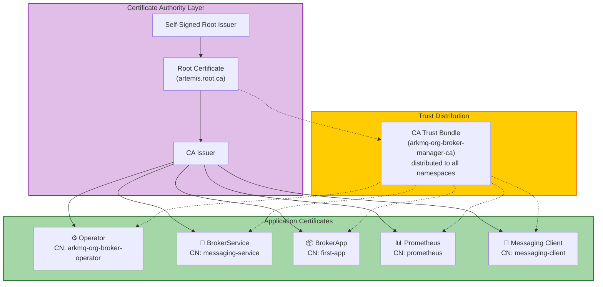
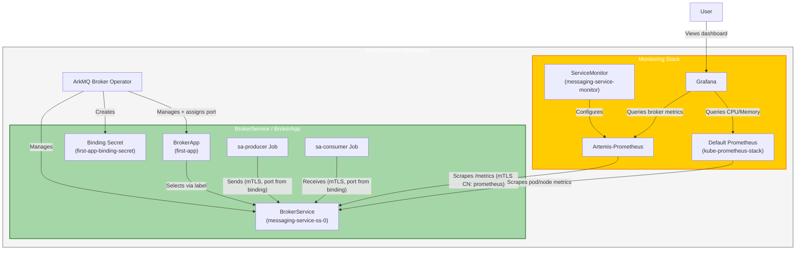
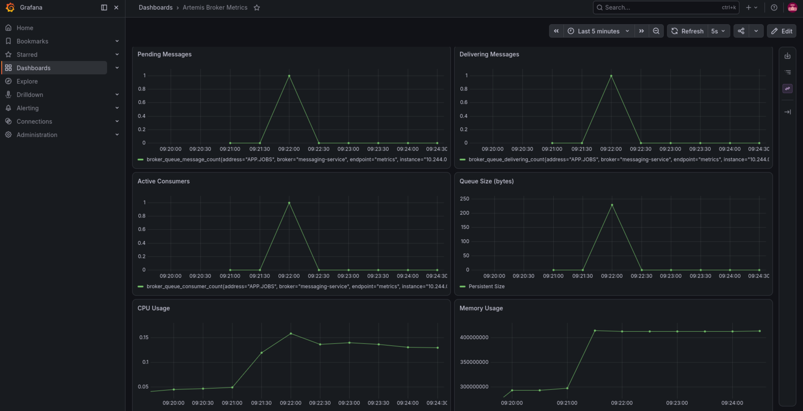

This tutorial introduces the operator's application-oriented CRDs —
`BrokerService` and `BrokerApp` — and shows how to monitor the underlying
broker with Prometheus and Grafana, all secured with mutual TLS (mTLS).

### The CRDs in this tutorial

**`BrokerService`** is a managed Apache Artemis broker instance designed to be
shared by multiple applications. You declare a `BrokerService` and the operator
handles the broker lifecycle, port management, and mTLS for every application
that binds to it.

**`BrokerApp`** represents an application's messaging intent. It declares which
addresses the application produces to or consumes from, and selects a
`BrokerService` via label selectors. The operator assigns it a dedicated port
on the service and creates a **binding secret** (`{app-name}-binding-secret`)
containing the `host`, `port`, and `uri` — the application reads these at
runtime without needing to know them in advance.

**`Broker`** is a single-instance broker CR focused on security and
observability. Compared to `BrokerCluster`:

| Feature | `Broker` | `BrokerCluster` |
|---|---|---|
| Clustering | ✗ Not supported | ✓ Supported |
| Password authentication | ✗ Absent — mTLS only | ✓ `adminUser` / `adminPassword` |
| Init container | ✗ Not used | ✓ Configurable |
| Web console | ✗ Not exposed | ✓ Configurable |
| Management (Jolokia) | mTLS, always on | Configurable |
| Prometheus metrics | mTLS, always on | Configurable |
| Acceptor configuration | Via `brokerProperties` | Explicit `acceptors` field |
| Use when | Security-first, observable, single node | Full control, clustering, legacy workloads |

**`BrokerService` and `BrokerApp` build on `Broker`** — when you deploy a
`BrokerService`, the operator creates a `Broker` under the hood and manages the
acceptors and certificates on your behalf.

**What is mTLS?** Mutual TLS means both the client and server authenticate each
other using certificates, providing stronger security than one-way TLS where
only the server is authenticated.

## Architecture Overview

### Certificate Infrastructure

All components in this tutorial are issued certificates by the same root CA,
giving a single trust anchor across both scenarios.



### Component Interactions

This diagram shows the operational flow between all components once everything
is deployed.



## Table of Contents

* [Architecture Overview](#architecture-overview)
* [Understanding the Security Model](#understanding-the-security-model)
* [Prerequisites](#prerequisites)
* [Setup](#setup)
* [Install the dependencies](#install-the-dependencies)
* [Create Certificate Authority and Issuers](#create-certificate-authority-and-issuers)
* [Deploy the Messaging Service and Application](#deploy-the-messaging-service-and-application)
* [Configure Prometheus Scraping](#configure-prometheus-scraping)
* [Deploy and Configure Grafana](#deploy-and-configure-grafana)
* [Visit Grafana's dashboard](#visit-grafanas-dashboard)
* [Exchange Messages](#exchange-messages)
* [Troubleshooting](#troubleshooting)
* [Cleanup](#cleanup)
* [Conclusion](#conclusion)

## Understanding the Security Model

This tutorial secures all components using mutual TLS (mTLS). Understanding how
certificates map to identities and permissions will help you follow the steps
and adapt the configuration to your own environment.

### How the operator configures mTLS on the Broker

The broker grants access based on certificate Common Names (CN) — the identity
field in a certificate that identifies who it belongs to. There are two separate
authentication realms.

**Control plane realm (Jolokia / Prometheus endpoint)**

Configured automatically by the operator for all `Broker` and `BrokerService`
CRs. The operator reads the actual CN values from the certificate secrets it
discovers in the namespace and generates the Jolokia agent config and Prometheus
exporter config accordingly — you do not need to specify CN values manually.
In this tutorial:
  * `CN=arkmq-org-broker-operator` → operator privileges (management)
  * `CN=prometheus` → metrics read access (Prometheus scraping)

You can use different CN values; the operator will extract them from your actual
certificates. For `BrokerService`, the operator additionally generates per-queue
Prometheus metrics for every address declared by bound `BrokerApp`s
automatically via a control-plane-override secret.

**Messaging realm (AMQPS acceptor)**

Configured manually via a JAAS secret for the standalone `Broker`, giving you
explicit control over which certificate CNs map to which roles. In this
tutorial:
  * `CN=messaging-client` → `messaging` role (send, consume, browse)

You can configure any CN values you need for your application clients by
updating the JAAS secret.

### Required Secrets Reference

All of the following secrets must exist before the `Broker` (or the `BrokerService`-managed broker) starts.

#### Operator infrastructure secrets

These are cluster-level secrets consumed by the operator daemon itself. Default names are shown; most can be overridden via environment variables on the operator deployment.

| Secret | Default name | CN in this tutorial | Override env var | Purpose |
|---|---|---|---| --- | 
| Operator client certificate | `arkmq-org-broker-manager-cert` | `arkmq-org-broker-operator` | `ARKMQ_ORG_BROKER_MANAGER_CERT_SECRET_NAME` | Operator certificate for authenticating with the broker |
| CA trust bundle | `arkmq-org-broker-manager-ca` | — | `ARKMQ_ORG_BROKER_MANAGER_CA_SECRET_NAME` | Root certificate that validates all others (key must be ca.pem) |
| Prometheus client certificate | `prometheus-cert` | `prometheus` | `BASE_PROMETHEUS_CERT_SECRET_NAME` | Prometheus certificate for authenticating to the metrics endpoint |

#### Workload secrets

The `BrokerService`/`BrokerApp` scenario uses the operator to manage the full certificate lifecycle automatically. These secrets are instance-scoped, with names derived from the CR name at runtime, and have no operator env var override. They are created by cert-manager during setup (see [Create the Service Certificate](#create-the-service-certificate) and [Create the Application Certificate](#create-the-application-certificate)). Note that the service certificate DNS names must match the Kubernetes service hostname so that mTLS clients can verify they are connecting to the right endpoint.

| Secret | Name in this tutorial | CN in this tutorial | Purpose |
|---|---|---|---|
| Service certificate | `messaging-service-broker-cert` | `messaging-service` | TLS identity of the `BrokerService` broker; mounted by the broker pod for its AMQP acceptor |
| App certificate | `first-app-app-cert` | `first-app` | mTLS credential presented by the producer/consumer when connecting to the app's dedicated acceptor |

## Prerequisites

Before you start, ensure you have the following tools and resources available.

### Required Tools

* **kubectl** v1.28+ — Kubernetes command-line tool
* **helm** v3.12+ — Package manager for Kubernetes
* **minikube** v1.30+ (or alternatives like [kind](https://kind.sigs.k8s.io/)
  v0.20+, [k3s](https://k3s.io/))
* **jq** — JSON processor (for extracting broker version)

### Minimum System Resources

* **CPU:** 4 cores minimum (for minikube VM + all components)
* **RAM:** 8 GB minimum (minikube will use ~6 GB)
* **Disk:** 20 GB free space

> **Note**: Make sure you're generating certificates in conformance with your organisation's guidelines.

## Setup

### Start Minikube

```bash {"stage":"init", "id":"minikube_start", "runtime":"bash", "label":"start minikube"}
minikube start --profile secure-monitoring-tutorial --memory=8192 --cpus=4
minikube profile secure-monitoring-tutorial
minikube addons enable metrics-server --profile secure-monitoring-tutorial
```
```shell markdown_runner
* [secure-monitoring-tutorial] minikube v1.38.1 on Fedora 44
* Automatically selected the docker driver. Other choices: kvm2, qemu2, ssh
* Using Docker driver with root privileges
* Starting "secure-monitoring-tutorial" primary control-plane node in "secure-monitoring-tutorial" cluster
* Pulling base image v0.0.50 ...
* Configuring bridge CNI (Container Networking Interface) ...
* Verifying Kubernetes components...
  - Using image gcr.io/k8s-minikube/storage-provisioner:v5
* Enabled addons: storage-provisioner, default-storageclass
* Done! kubectl is now configured to use "secure-monitoring-tutorial" cluster and "default" namespace by default
* minikube profile was successfully set to secure-monitoring-tutorial
* metrics-server is an addon maintained by Kubernetes. For any concerns contact minikube on GitHub.
You can view the list of minikube maintainers at: https://github.com/kubernetes/minikube/blob/master/OWNERS
  - Using image registry.k8s.io/metrics-server/metrics-server:v0.8.1
* The 'metrics-server' addon is enabled
! Starting v1.39.0, minikube will default to "containerd" container runtime. See #21973 for more info.
```

The `--memory=8192 --cpus=4` allocation covers all components deployed in this
tutorial: the operator, `kube-prometheus-stack` (Prometheus + Grafana),
cert-manager, trust-manager, and the brokers themselves.

### Enable nginx ingress for minikube

The ingress controller is used later to expose Grafana outside the cluster.
SSL passthrough is not required for this tutorial since the Grafana ingress
uses plain HTTP, but enabling ingress here keeps setup self-contained.

```bash {"stage":"init", "runtime":"bash", "label":"enable nginx ingress for minikube"}
minikube addons enable ingress
minikube kubectl -- patch deployment -n ingress-nginx ingress-nginx-controller --type='json' -p='[{"op": "add", "path": "/spec/template/spec/containers/0/args/-", "value":"--enable-ssl-passthrough"}]'
```
```shell markdown_runner
* ingress is an addon maintained by Kubernetes. For any concerns contact minikube on GitHub.
You can view the list of minikube maintainers at: https://github.com/kubernetes/minikube/blob/master/OWNERS
  - Using image registry.k8s.io/ingress-nginx/controller:v1.14.3
  - Using image registry.k8s.io/ingress-nginx/kube-webhook-certgen:v1.6.7
  - Using image registry.k8s.io/ingress-nginx/kube-webhook-certgen:v1.6.7
* Verifying ingress addon...
* The 'ingress' addon is enabled
deployment.apps/ingress-nginx-controller patched
```

### Get minikube's IP

This will be used later to construct the Ingress hostname for Grafana.

```bash {"stage":"init", "runtime":"bash", "label":"get the cluster ip"}
export CLUSTER_IP=$(minikube ip --profile secure-monitoring-tutorial)
```
```shell markdown_runner

```

### Create the namespace

All resources for this tutorial will be created in the `broker-tutorial` namespace.

```bash {"stage":"init", "runtime":"bash", "label":"create the namespace"}
kubectl create namespace broker-tutorial
kubectl config set-context --current --namespace=broker-tutorial
until kubectl get serviceaccount default -n broker-tutorial &> /dev/null; do sleep 1; done
```
```shell markdown_runner
namespace/broker-tutorial created
Context "secure-monitoring-tutorial" modified.
```

## Install the dependencies

### Install Prometheus Operator

The `kube-prometheus-stack` Helm chart installs Prometheus, Grafana, and the
Prometheus Operator in one step. This is needed for the `Broker` monitoring
section later.

```bash {"stage":"init", "runtime":"bash", "label":"install the prometheus operator"}
helm repo add prometheus-community https://prometheus-community.github.io/helm-charts
helm upgrade -i prometheus prometheus-community/kube-prometheus-stack \
  -n broker-tutorial \
  --set grafana.sidecar.dashboards.namespace=ALL \
  --set grafana.sidecar.dashboards.enabled=true \
  --set grafana.sidecar.datasources.enabled=true \
  --set grafana.sidecar.datasources.label=grafana_datasource \
  --set kubeEtcd.enabled=false \
  --set kubeControllerManager.enabled=false \
  --set kubeScheduler.enabled=false \
  --wait
```
```shell markdown_runner
"prometheus-community" already exists with the same configuration, skipping
Release "prometheus" does not exist. Installing it now.
NAME: prometheus
LAST DEPLOYED: Fri Aug 28 14:52:06 2026
NAMESPACE: broker-tutorial
STATUS: deployed
REVISION: 1
DESCRIPTION: Install complete
TEST SUITE: None
NOTES:
kube-prometheus-stack has been installed. Check its status by running:
  kubectl --namespace broker-tutorial get pods -l "release=prometheus"

Get Grafana 'admin' user password by running:

  kubectl --namespace broker-tutorial get secrets prometheus-grafana -o jsonpath="{.data.admin-password}" | base64 -d ; echo

Access Grafana local instance:

  export POD_NAME=$(kubectl --namespace broker-tutorial get pod -l "app.kubernetes.io/name=grafana,app.kubernetes.io/instance=prometheus" -oname)
  kubectl --namespace broker-tutorial port-forward $POD_NAME 3000

Get your grafana admin user password by running:

  kubectl get secret --namespace broker-tutorial -l app.kubernetes.io/component=admin-secret -o jsonpath="{.items[0].data.admin-password}" | base64 --decode ; echo


Visit https://github.com/prometheus-operator/kube-prometheus for instructions on how to create & configure Alertmanager and Prometheus instances using the Operator.
```

### Install Cert-Manager

```bash {"stage":"init", "runtime":"bash", "label":"install cert-manager"}
kubectl apply -f https://github.com/cert-manager/cert-manager/releases/download/v1.20.0/cert-manager.yaml
```
```shell markdown_runner
namespace/cert-manager created
customresourcedefinition.apiextensions.k8s.io/challenges.acme.cert-manager.io created
customresourcedefinition.apiextensions.k8s.io/orders.acme.cert-manager.io created
customresourcedefinition.apiextensions.k8s.io/certificaterequests.cert-manager.io created
customresourcedefinition.apiextensions.k8s.io/certificates.cert-manager.io created
customresourcedefinition.apiextensions.k8s.io/clusterissuers.cert-manager.io created
customresourcedefinition.apiextensions.k8s.io/issuers.cert-manager.io created
serviceaccount/cert-manager-cainjector created
serviceaccount/cert-manager created
serviceaccount/cert-manager-webhook created
clusterrole.rbac.authorization.k8s.io/cert-manager-cainjector created
clusterrole.rbac.authorization.k8s.io/cert-manager-controller-issuers created
clusterrole.rbac.authorization.k8s.io/cert-manager-controller-clusterissuers created
clusterrole.rbac.authorization.k8s.io/cert-manager-controller-certificates created
clusterrole.rbac.authorization.k8s.io/cert-manager-controller-orders created
clusterrole.rbac.authorization.k8s.io/cert-manager-controller-challenges created
clusterrole.rbac.authorization.k8s.io/cert-manager-controller-ingress-shim created
clusterrole.rbac.authorization.k8s.io/cert-manager-cluster-view created
clusterrole.rbac.authorization.k8s.io/cert-manager-view created
clusterrole.rbac.authorization.k8s.io/cert-manager-edit created
clusterrole.rbac.authorization.k8s.io/cert-manager-controller-approve:cert-manager-io created
clusterrole.rbac.authorization.k8s.io/cert-manager-controller-certificatesigningrequests created
clusterrole.rbac.authorization.k8s.io/cert-manager-webhook:subjectaccessreviews created
clusterrolebinding.rbac.authorization.k8s.io/cert-manager-cainjector created
clusterrolebinding.rbac.authorization.k8s.io/cert-manager-controller-issuers created
clusterrolebinding.rbac.authorization.k8s.io/cert-manager-controller-clusterissuers created
clusterrolebinding.rbac.authorization.k8s.io/cert-manager-controller-certificates created
clusterrolebinding.rbac.authorization.k8s.io/cert-manager-controller-orders created
clusterrolebinding.rbac.authorization.k8s.io/cert-manager-controller-challenges created
clusterrolebinding.rbac.authorization.k8s.io/cert-manager-controller-ingress-shim created
clusterrolebinding.rbac.authorization.k8s.io/cert-manager-controller-approve:cert-manager-io created
clusterrolebinding.rbac.authorization.k8s.io/cert-manager-controller-certificatesigningrequests created
clusterrolebinding.rbac.authorization.k8s.io/cert-manager-webhook:subjectaccessreviews created
role.rbac.authorization.k8s.io/cert-manager-cainjector:leaderelection created
role.rbac.authorization.k8s.io/cert-manager:leaderelection created
role.rbac.authorization.k8s.io/cert-manager-tokenrequest created
role.rbac.authorization.k8s.io/cert-manager-webhook:dynamic-serving created
rolebinding.rbac.authorization.k8s.io/cert-manager-cainjector:leaderelection created
rolebinding.rbac.authorization.k8s.io/cert-manager:leaderelection created
rolebinding.rbac.authorization.k8s.io/cert-manager-tokenrequest created
rolebinding.rbac.authorization.k8s.io/cert-manager-webhook:dynamic-serving created
service/cert-manager-cainjector created
service/cert-manager created
service/cert-manager-webhook created
deployment.apps/cert-manager-cainjector created
deployment.apps/cert-manager created
deployment.apps/cert-manager-webhook created
mutatingwebhookconfiguration.admissionregistration.k8s.io/cert-manager-webhook created
validatingwebhookconfiguration.admissionregistration.k8s.io/cert-manager-webhook created
```

Wait for cert-manager to be ready.

```bash {"stage":"init", "runtime":"bash", "label":"wait for cert-manager"}
kubectl wait pod --all --for=condition=Ready --namespace=cert-manager --timeout=600s
```
```shell markdown_runner
pod/cert-manager-67596fb4d7-6gnjq condition met
pod/cert-manager-cainjector-5fcbcd7fb-r5np8 condition met
pod/cert-manager-webhook-864d6c4d87-zn9sk condition met
```

### Install Trust Manager

Add the Jetstack Helm repository.

```bash {"stage":"init", "label":"add jetstack helm repo", "runtime":"bash"}
helm repo add jetstack https://charts.jetstack.io --force-update
```
```shell markdown_runner
"jetstack" has been added to your repositories
```

Install `trust-manager`, configured to sync trust bundles to Secrets in all namespaces.

```bash {"stage":"init", "label":"install trust-manager", "runtime":"bash"}
helm upgrade trust-manager jetstack/trust-manager --install --namespace cert-manager --set secretTargets.enabled=true --set secretTargets.authorizedSecretsAll=true --wait
```
```shell markdown_runner
Release "trust-manager" does not exist. Installing it now.
NAME: trust-manager
LAST DEPLOYED: Fri Aug 28 14:53:38 2026
NAMESPACE: cert-manager
STATUS: deployed
REVISION: 1
DESCRIPTION: Install complete
TEST SUITE: None
NOTES:
⚠️  WARNING: Consider increasing the Helm value `replicaCount` to 2 if you require high availability.
⚠️  WARNING: Consider setting the Helm value `podDisruptionBudget.enabled` to true if you require high availability.

trust-manager v0.24.0 has been deployed successfully!
Your installation includes a default CA package, using the following
default CA package image:

:

It's imperative that you keep the default CA package image up to date.
To find out more about securely running trust-manager and to get started
with creating your first bundle, check out the documentation on the
cert-manager website:

https://cert-manager.io/docs/projects/trust-manager/
```

Wait for the Bundles CRD to be ready.

```bash {"stage":"init", "label":"wait for trust-manager", "runtime":"bash"}
kubectl wait crd bundles.trust.cert-manager.io --for=create --timeout=240s
kubectl wait pod --all --for=condition=Ready --namespace=cert-manager --timeout=600s
```
```shell markdown_runner
customresourcedefinition.apiextensions.k8s.io/bundles.trust.cert-manager.io condition met
pod/cert-manager-67596fb4d7-6gnjq condition met
pod/cert-manager-cainjector-5fcbcd7fb-r5np8 condition met
pod/cert-manager-webhook-864d6c4d87-zn9sk condition met
pod/trust-manager-64dfc6649-mgpzq condition met
```

### Deploy the Operator

From the root of the operator repository, install the operator into the
`broker-tutorial` namespace.

```bash {"stage":"init", "rootdir":"$initial_dir"}
./deploy/install_opr.sh
```
```shell markdown_runner
Deploying operator to watch single namespace
Client Version: 4.22.4
Kustomize Version: v5.7.1
Kubernetes Version: v1.35.1
customresourcedefinition.apiextensions.k8s.io/activemqartemises.broker.amq.io created
customresourcedefinition.apiextensions.k8s.io/activemqartemisaddresses.broker.amq.io created
customresourcedefinition.apiextensions.k8s.io/activemqartemisscaledowns.broker.amq.io created
customresourcedefinition.apiextensions.k8s.io/activemqartemissecurities.broker.amq.io created
customresourcedefinition.apiextensions.k8s.io/brokers.broker.arkmq.org created
customresourcedefinition.apiextensions.k8s.io/brokerapps.broker.arkmq.org created
customresourcedefinition.apiextensions.k8s.io/brokerclusters.broker.arkmq.org created
customresourcedefinition.apiextensions.k8s.io/brokerservices.broker.arkmq.org created
serviceaccount/arkmq-org-broker-controller-manager created
role.rbac.authorization.k8s.io/arkmq-org-broker-operator-role created
rolebinding.rbac.authorization.k8s.io/arkmq-org-broker-operator-rolebinding created
role.rbac.authorization.k8s.io/arkmq-org-broker-leader-election-role created
rolebinding.rbac.authorization.k8s.io/arkmq-org-broker-leader-election-rolebinding created
networkpolicy.networking.k8s.io/arkmq-org-broker-controller-manager-netpol created
deployment.apps/arkmq-org-broker-controller-manager created
```

Wait for the operator pod to become ready.

```bash {"stage":"init", "label":"wait for the operator to be running", "runtime":"bash"}
kubectl wait deployment arkmq-org-broker-controller-manager --for=create --timeout=240s
kubectl wait pod --all --for=condition=Ready --namespace=broker-tutorial --timeout=600s
```
```shell markdown_runner
deployment.apps/arkmq-org-broker-controller-manager condition met
pod/alertmanager-prometheus-kube-prometheus-alertmanager-0 condition met
pod/arkmq-org-broker-controller-manager-67bdbdf78d-9v9md condition met
pod/prometheus-grafana-6445977db5-9qbj5 condition met
pod/prometheus-kube-prometheus-operator-b489bc45c-m2p28 condition met
pod/prometheus-kube-state-metrics-58b7869c8f-8sfcb condition met
pod/prometheus-prometheus-kube-prometheus-prometheus-0 condition met
pod/prometheus-prometheus-node-exporter-cszx2 condition met
```

## Create Certificate Authority and Issuers

All components in this tutorial share the same PKI hierarchy. We set it up once
here and all later certificate requests reference it.

**Certificate chain:** self-signed root issuer → root CA certificate → CA
issuer → individual component certificates. Trusting the root CA is enough to
validate every certificate in the tutorial.

### Create a Root CA

Create a self-signed `ClusterIssuer` to act as the root Certificate Authority.

```bash {"stage":"deploy_certs", "label":"create root issuer", "runtime":"bash"}
kubectl apply -f - <<EOF
apiVersion: cert-manager.io/v1
kind: ClusterIssuer
metadata:
  name: selfsigned-root-issuer
spec:
  selfSigned: {}
EOF
```
```shell markdown_runner
clusterissuer.cert-manager.io/selfsigned-root-issuer created
```

```bash {"stage":"deploy_certs", "label":"wait for root issuer", "runtime":"bash"}
kubectl wait clusterissuer selfsigned-root-issuer --for=condition=Ready --timeout=300s
```
```shell markdown_runner
clusterissuer.cert-manager.io/selfsigned-root-issuer condition met
```

Create the root certificate in the `cert-manager` namespace.

```bash {"stage":"deploy_certs", "label":"create root cert", "runtime":"bash"}
kubectl apply -f - <<EOF
apiVersion: cert-manager.io/v1
kind: Certificate
metadata:
  name: root-ca
  namespace: cert-manager
spec:
  isCA: true
  commonName: artemis.root.ca
  secretName: root-ca-secret
  issuerRef:
    name: selfsigned-root-issuer
    kind: ClusterIssuer
    group: cert-manager.io
EOF
```
```shell markdown_runner
certificate.cert-manager.io/root-ca created
```

```bash {"stage":"deploy_certs", "label":"wait for root cert", "runtime":"bash"}
kubectl wait certificate root-ca -n cert-manager --for=condition=Ready --timeout=300s
```
```shell markdown_runner
certificate.cert-manager.io/root-ca condition met
```

### Create a CA Bundle

Create a `trust-manager` `Bundle` that reads the root CA secret and distributes
the CA certificate as a secret to all namespaces, including `broker-tutorial`.
This single bundle is the trust anchor for every component in the tutorial.

```bash {"stage":"deploy_certs", "label":"create ca bundle", "runtime":"bash"}
kubectl apply -f - <<EOF
apiVersion: trust.cert-manager.io/v1alpha1
kind: Bundle
metadata:
  name: arkmq-org-broker-manager-ca
  namespace: cert-manager
spec:
  sources:
  - secret:
      name: root-ca-secret
      key: "tls.crt"
  target:
    secret:
      key: "ca.pem"
EOF
```
```shell markdown_runner
bundle.trust.cert-manager.io/arkmq-org-broker-manager-ca created
```

```bash {"stage":"deploy_certs", "label":"wait for ca bundle", "runtime":"bash"}
kubectl wait bundle arkmq-org-broker-manager-ca -n cert-manager --for=condition=Synced --timeout=300s
```
```shell markdown_runner
bundle.trust.cert-manager.io/arkmq-org-broker-manager-ca condition met
```

### Create a Cluster Issuer

Create a `ClusterIssuer` that signs all component certificates using the root CA.

```bash {"stage":"deploy_certs", "label":"create ca issuer", "runtime":"bash"}
kubectl apply -f - <<EOF
apiVersion: cert-manager.io/v1
kind: ClusterIssuer
metadata:
  name: ca-issuer
spec:
  ca:
    secretName: root-ca-secret
EOF
```
```shell markdown_runner
clusterissuer.cert-manager.io/ca-issuer created
```

```bash {"stage":"deploy_certs", "label":"wait for ca issuer", "runtime":"bash"}
kubectl wait clusterissuer ca-issuer --for=condition=Ready --timeout=300s
```
```shell markdown_runner
clusterissuer.cert-manager.io/ca-issuer condition met
```

### Create the Operator Certificate

The operator authenticates with every broker it manages using this certificate.

```bash {"stage":"deploy_certs", "label":"create operator cert", "runtime":"bash"}
kubectl apply -f - <<EOF
apiVersion: cert-manager.io/v1
kind: Certificate
metadata:
  name: arkmq-org-broker-manager-cert
  namespace: broker-tutorial
spec:
  secretName: arkmq-org-broker-manager-cert
  commonName: arkmq-org-broker-operator
  issuerRef:
    name: ca-issuer
    kind: ClusterIssuer
EOF
```
```shell markdown_runner
certificate.cert-manager.io/arkmq-org-broker-manager-cert created
```

```bash {"stage":"deploy_certs", "label":"wait for operator cert", "runtime":"bash"}
kubectl wait certificate arkmq-org-broker-manager-cert -n broker-tutorial --for=condition=Ready --timeout=300s
```
```shell markdown_runner
certificate.cert-manager.io/arkmq-org-broker-manager-cert condition met
```

### Create the Prometheus Certificate

Prometheus uses this certificate to authenticate with the broker's mTLS metrics
endpoint. The operator reads the CN and grants it metrics read access automatically.

```bash {"stage":"deploy_certs", "label":"create prometheus cert", "runtime":"bash"}
kubectl apply -f - <<EOF
apiVersion: cert-manager.io/v1
kind: Certificate
metadata:
  name: prometheus-cert
  namespace: broker-tutorial
spec:
  secretName: prometheus-cert
  commonName: prometheus
  issuerRef:
    name: ca-issuer
    kind: ClusterIssuer
EOF
```
```shell markdown_runner
certificate.cert-manager.io/prometheus-cert created
```

```bash {"stage":"deploy_certs", "label":"wait for prometheus cert", "runtime":"bash"}
kubectl wait certificate prometheus-cert -n broker-tutorial --for=condition=Ready --timeout=300s
```
```shell markdown_runner
certificate.cert-manager.io/prometheus-cert condition met
```

## Deploy the Messaging Service and Application

With the PKI in place, we can now deploy a `BrokerService` and a `BrokerApp`.
The operator will automatically assign a port from the service's pool for the
application's acceptor and expose the connection details in a binding secret.

### Create the Service Certificate

The service needs a certificate with DNS names matching its Kubernetes service
hostname so that mTLS clients can verify they are connecting to the right endpoint.

```bash {"stage":"deploy_service", "label":"create service cert", "runtime":"bash"}
kubectl apply -f - <<EOF
apiVersion: cert-manager.io/v1
kind: Certificate
metadata:
  name: messaging-service-broker-cert
  namespace: broker-tutorial
spec:
  secretName: messaging-service-broker-cert
  commonName: messaging-service
  dnsNames:
  - messaging-service
  - messaging-service.broker-tutorial.svc.cluster.local
  - '*.messaging-service-hdls-svc.broker-tutorial.svc.cluster.local'
  issuerRef:
    name: ca-issuer
    kind: ClusterIssuer
EOF
```
```shell markdown_runner
certificate.cert-manager.io/messaging-service-broker-cert created
```

```bash {"stage":"deploy_service", "label":"wait for service cert", "runtime":"bash"}
kubectl wait certificate messaging-service-broker-cert -n broker-tutorial --for=condition=Ready --timeout=300s
```
```shell markdown_runner
certificate.cert-manager.io/messaging-service-broker-cert condition met
```

### Deploy `BrokerService`

```bash {"stage":"deploy_service", "label":"deploy service crd", "runtime":"bash"}
kubectl apply -f - <<EOF
apiVersion: broker.arkmq.org/v1beta2
kind: BrokerService
metadata:
  name: messaging-service
  namespace: broker-tutorial
  labels:
    forWorkQueue: "true"
spec:
  resources:
    limits:
      memory: "1Gi"
  env:
    - name: JAVA_ARGS_APPEND
      value: "-Dlog4j2.level=INFO"
EOF
```
```shell markdown_runner
brokerservice.broker.arkmq.org/messaging-service created
```

```bash {"stage":"deploy_service", "label":"wait for service", "runtime":"bash"}
kubectl wait BrokerService messaging-service -n broker-tutorial --for=condition=Ready --timeout=300s
```
```shell markdown_runner
brokerservice.broker.arkmq.org/messaging-service condition met
```

### Create the Application Certificate

```bash {"stage":"deploy_app", "label":"create app cert", "runtime":"bash"}
kubectl apply -f - <<EOF
apiVersion: cert-manager.io/v1
kind: Certificate
metadata:
  name: first-app-app-cert
  namespace: broker-tutorial
spec:
  secretName: first-app-app-cert
  commonName: first-app
  issuerRef:
    name: ca-issuer
    kind: ClusterIssuer
EOF
```
```shell markdown_runner
certificate.cert-manager.io/first-app-app-cert created
```

```bash {"stage":"deploy_app", "label":"wait for app cert", "runtime":"bash"}
kubectl wait certificate first-app-app-cert -n broker-tutorial --for=condition=Ready --timeout=300s
```
```shell markdown_runner
certificate.cert-manager.io/first-app-app-cert condition met
```

### Deploy `BrokerApp`

The `BrokerApp` connects to a `BrokerService` using label selectors and declares
its messaging capabilities. The operator automatically assigns a port from the
service's port pool for the application's acceptor.

```bash {"stage":"deploy_app", "label":"deploy app crd", "runtime":"bash"}
kubectl apply -f - <<EOF
apiVersion: broker.arkmq.org/v1beta2
kind: BrokerApp
metadata:
  name: first-app
  namespace: broker-tutorial
spec:
  selector:
    matchLabels:
      forWorkQueue: "true"
  capabilities:
    - producerOf:
        - address: "APP.JOBS"
      consumerOf:
        - address: "APP.JOBS"
EOF
```
```shell markdown_runner
brokerapp.broker.arkmq.org/first-app created
```

```bash {"stage":"deploy_app", "label":"wait for app", "runtime":"bash"}
kubectl wait BrokerApp first-app -n broker-tutorial --for=condition=Ready --timeout=300s
```
```shell markdown_runner
brokerapp.broker.arkmq.org/first-app condition met
```

### Verify Port Assignment

You can check the automatically assigned port in the app's status:

```bash {"stage":"deploy_app", "label":"check assigned port", "runtime":"bash"}
kubectl get BrokerApp first-app -n broker-tutorial -o jsonpath='{.status.service.assignedPort}'
```
```shell markdown_runner
61616
```

### Test Messaging

Create the `cert-pemcfg` secret that tells the messaging client jobs how to
locate their PEM certificate and key files.

```bash {"stage":"test_messaging", "label":"create pemcfg secret", "runtime":"bash"}
kubectl apply -f - <<EOF
apiVersion: v1
kind: Secret
metadata:
  name: cert-pemcfg
  namespace: broker-tutorial
type: Opaque
stringData:
  tls.pemcfg: |
    source.key=/app/tls/client/tls.key
    source.cert=/app/tls/client/tls.crt
  java.security: security.provider.6=de.dentrassi.crypto.pem.PemKeyStoreProvider
EOF
```
```shell markdown_runner
secret/cert-pemcfg created
```

The producer and consumer jobs read the broker hostname and port from the
`first-app-binding-secret` that the operator created automatically.

```bash {"stage":"test_messaging", "label":"run producer", "runtime":"bash"}
cat <<'EOT' | kubectl apply -f -
apiVersion: batch/v1
kind: Job
metadata:
  name: sa-producer
  namespace: broker-tutorial
spec:
  template:
    spec:
      containers:
      - name: producer
        image: quay.io/arkmq-org/arkmq-org-broker-kubernetes:artemis.2.40.0
        command:
        - "/bin/sh"
        - "-c"
        - exec java -classpath /opt/amq/lib/*:/opt/amq/lib/extra/* org.apache.activemq.artemis.cli.Artemis producer --protocol=AMQP --url amqps://${BROKER_SERVICE_HOST}:${BROKER_SERVICE_PORT}\?transport.trustStoreType=PEMCA\&transport.trustStoreLocation=/app/tls/ca/ca.pem\&transport.keyStoreType=PEMCFG\&transport.keyStoreLocation=/app/tls/pem/tls.pemcfg --message-count 1 --destination queue://APP.JOBS;
        env:
        - name: JDK_JAVA_OPTIONS
          value: "-Djava.security.properties=/app/tls/pem/java.security"
        - name: BROKER_SERVICE_HOST
          valueFrom:
            secretKeyRef:
              name: first-app-binding-secret
              key: host
        - name: BROKER_SERVICE_PORT
          valueFrom:
            secretKeyRef:
              name: first-app-binding-secret
              key: port
        volumeMounts:
        - name: trust
          mountPath: /app/tls/ca
        - name: cert
          mountPath: /app/tls/client
        - name: pem
          mountPath: /app/tls/pem
      volumes:
      - name: trust
        secret:
          secretName: arkmq-org-broker-manager-ca
      - name: cert
        secret:
          secretName: first-app-app-cert
      - name: pem
        secret:
          secretName: cert-pemcfg
      restartPolicy: OnFailure
EOT
```
```shell markdown_runner
job.batch/sa-producer created
```

```bash {"stage":"test_messaging", "label":"run consumer", "runtime":"bash"}
cat <<'EOT' | kubectl apply -f -
apiVersion: batch/v1
kind: Job
metadata:
  name: sa-consumer
  namespace: broker-tutorial
spec:
  template:
    spec:
      containers:
      - name: consumer
        image: quay.io/arkmq-org/arkmq-org-broker-kubernetes:artemis.2.40.0
        command:
        - "/bin/sh"
        - "-c"
        - exec java -classpath /opt/amq/lib/*:/opt/amq/lib/extra/* org.apache.activemq.artemis.cli.Artemis consumer --protocol=AMQP --url amqps://${BROKER_SERVICE_HOST}:${BROKER_SERVICE_PORT}\?transport.trustStoreType=PEMCA\&transport.trustStoreLocation=/app/tls/ca/ca.pem\&transport.keyStoreType=PEMCFG\&transport.keyStoreLocation=/app/tls/pem/tls.pemcfg --message-count 1 --destination queue://APP.JOBS --receive-timeout 10000;
        env:
        - name: JDK_JAVA_OPTIONS
          value: "-Djava.security.properties=/app/tls/pem/java.security"
        - name: BROKER_SERVICE_HOST
          valueFrom:
            secretKeyRef:
              name: first-app-binding-secret
              key: host
        - name: BROKER_SERVICE_PORT
          valueFrom:
            secretKeyRef:
              name: first-app-binding-secret
              key: port
        volumeMounts:
        - name: trust
          mountPath: /app/tls/ca
        - name: cert
          mountPath: /app/tls/client
        - name: pem
          mountPath: /app/tls/pem
      volumes:
      - name: trust
        secret:
          secretName: arkmq-org-broker-manager-ca
      - name: cert
        secret:
          secretName: first-app-app-cert
      - name: pem
        secret:
          secretName: cert-pemcfg
      restartPolicy: OnFailure
EOT
```
```shell markdown_runner
job.batch/sa-consumer created
```

```bash {"stage":"test_messaging", "label":"wait for jobs", "runtime":"bash"}
kubectl wait job sa-producer -n broker-tutorial --for=condition=Complete --timeout=300s
kubectl wait job sa-consumer -n broker-tutorial --for=condition=Complete --timeout=300s
```
```shell markdown_runner
job.batch/sa-producer condition met
job.batch/sa-consumer condition met
```

## Configure Prometheus Scraping

The `BrokerService` already manages a running broker pod
(`messaging-service-ss-0`) with a Prometheus metrics endpoint on port `8888`.
We now deploy a dedicated Prometheus instance and configure it to scrape those
metrics over mTLS, using the certificate created in the
[PKI section](#create-certificate-authority-and-issuers).

### Configure and Deploy Prometheus

```bash {"stage":"scrape", "runtime":"bash", "label":"set broker fqdn"}
export BROKER_FQDN=messaging-service-ss-0.messaging-service-hdls-svc.broker-tutorial.svc.cluster.local
```
```shell markdown_runner

```

Create the metrics `Service` selecting the `BrokerService`-managed pod, a
`ServiceMonitor` that tells Prometheus how to scrape it with mTLS, a dedicated
`Prometheus` instance, and a service for it so Grafana can target it directly
without load-balancing across instances.

```bash {"stage":"scrape", "runtime":"bash", "label":"create prometheus resources"}
kubectl apply -f - <<EOF
apiVersion: v1
kind: Service
metadata:
  name: messaging-service-metrics
  namespace: broker-tutorial
  labels:
    app: messaging-service
spec:
  selector:
    ActiveMQArtemis: messaging-service
  ports:
    - name: metrics
      port: 8888
      targetPort: 8888
      protocol: TCP
---
apiVersion: monitoring.coreos.com/v1
kind: ServiceMonitor
metadata:
  name: messaging-service-monitor
  namespace: broker-tutorial
  labels:
    app: messaging-service
spec:
  selector:
    matchLabels:
      app: messaging-service
  endpoints:
  - port: metrics
    scheme: https
    tlsConfig:
      serverName: '${BROKER_FQDN}'
      ca:
        secret:
          name: arkmq-org-broker-manager-ca
          key: ca.pem
      cert:
        secret:
          name: prometheus-cert
          key: tls.crt
      keySecret:
        name: prometheus-cert
        key: tls.key
---
apiVersion: monitoring.coreos.com/v1
kind: Prometheus
metadata:
  name: artemis-prometheus
  namespace: broker-tutorial
spec:
  replicas: 1
  serviceAccountName: prometheus-kube-prometheus-prometheus
  version: v2.53.0
  serviceMonitorSelector:
    matchLabels:
      app: messaging-service
  serviceMonitorNamespaceSelector: {}
---
apiVersion: v1
kind: Service
metadata:
  name: artemis-prometheus-svc
  namespace: broker-tutorial
spec:
  selector:
    prometheus: artemis-prometheus
  ports:
    - name: web
      port: 9090
      targetPort: 9090
      protocol: TCP
EOF
```
```shell markdown_runner
service/messaging-service-metrics created
servicemonitor.monitoring.coreos.com/messaging-service-monitor created
prometheus.monitoring.coreos.com/artemis-prometheus created
service/artemis-prometheus-svc created
```

Grant the Prometheus ServiceAccount the permissions it needs for service
discovery.

```bash {"stage":"scrape", "runtime":"bash", "label":"grant prometheus permissions"}
kubectl apply -f - <<EOF
apiVersion: rbac.authorization.k8s.io/v1
kind: ClusterRoleBinding
metadata:
  name: prometheus-cluster-role-binding
subjects:
- kind: ServiceAccount
  name: prometheus-kube-prometheus-prometheus
  namespace: broker-tutorial
roleRef:
  kind: ClusterRole
  name: prometheus-kube-prometheus-prometheus
  apiGroup: rbac.authorization.k8s.io
EOF
```
```shell markdown_runner
clusterrolebinding.rbac.authorization.k8s.io/prometheus-cluster-role-binding created
```

```bash {"stage":"scrape", "runtime":"bash", "label":"wait for prometheus"}
sleep 5
kubectl rollout status statefulset/prometheus-artemis-prometheus -n broker-tutorial --timeout=300s
```
```shell markdown_runner
Waiting for 1 pods to be ready...
statefulset rolling update complete 1 pods at revision prometheus-artemis-prometheus-6698fbd945...
```

## Deploy and Configure Grafana

### Configure Grafana Datasources

Create a `ConfigMap` defining the Artemis-Prometheus datasource. The Grafana
sidecar picks this up automatically via the `grafana_datasource: "1"` label.

```bash {"stage":"grafana", "runtime":"bash", "label":"create grafana datasource"}
kubectl apply -f - <<EOF
apiVersion: v1
kind: ConfigMap
metadata:
  name: grafana-datasource-artemis
  namespace: broker-tutorial
  labels:
    grafana_datasource: "1"
data:
  datasource.yaml: |
    apiVersion: 1
    datasources:
    - name: Artemis-Prometheus
      type: prometheus
      access: proxy
      url: http://artemis-prometheus-svc:9090
      isDefault: false
      editable: false
      uid: artemis-prometheus
      jsonData:
        timeInterval: 30s
EOF
```
```shell markdown_runner
configmap/grafana-datasource-artemis created
```

Restart Grafana to pick up the new datasource.

```bash {"stage":"grafana", "runtime":"bash", "label":"restart grafana for datasources"}
kubectl rollout restart deployment prometheus-grafana -n broker-tutorial
kubectl rollout status deployment prometheus-grafana -n broker-tutorial --timeout=300s
```
```shell markdown_runner
deployment.apps/prometheus-grafana restarted
Waiting for deployment "prometheus-grafana" rollout to finish: 1 old replicas are pending termination...
Waiting for deployment "prometheus-grafana" rollout to finish: 1 old replicas are pending termination...
deployment "prometheus-grafana" successfully rolled out
```

Wait a moment and verify both Prometheus instances and datasources:

``` bash {"stage":"grafana", "runtime":"bash", "label":"test prometheus connectivity"}
echo "Testing Prometheus and Grafana datasource configuration..."
echo ""

# Test 1: Artemis-Prometheus connectivity
echo "✓ Test 1: Artemis-Prometheus is reachable"
ARTEMIS_PROM_STATUS=$(kubectl run test-artemis-prom --rm -i --restart=Never --image=curlimages/curl:latest -n broker-tutorial -- \
  curl -s http://artemis-prometheus-svc:9090/api/v1/query?query=up --max-time 5 2>/dev/null | grep -o '"status":"success"' || echo "")
if [ -z "$ARTEMIS_PROM_STATUS" ]; then
  echo "  ✗ FAILED: Cannot connect to artemis-prometheus-svc:9090"
  exit 1
fi
echo "  artemis-prometheus-svc:9090 is responding"

# Test 2: Cluster-Prometheus connectivity
echo "✓ Test 2: Cluster-Prometheus is reachable"
CLUSTER_PROM_STATUS=$(kubectl run test-cluster-prom --rm -i --restart=Never --image=curlimages/curl:latest -n broker-tutorial -- \
  curl -s http://prometheus-kube-prometheus-prometheus:9090/api/v1/query?query=up --max-time 5 2>/dev/null | grep -o '"status":"success"' || echo "")
if [ -z "$CLUSTER_PROM_STATUS" ]; then
  echo "  ✗ FAILED: Cannot connect to prometheus-kube-prometheus-prometheus:9090"
  exit 1
fi
echo "  prometheus-kube-prometheus-prometheus:9090 is responding"

# Test 3: Broker metrics availability (retry until Prometheus has scraped at least once)
echo "✓ Test 3: Broker metrics are available in Artemis-Prometheus"
BROKER_METRICS=""
for i in $(seq 1 24); do
  BROKER_METRICS=$(kubectl run test-broker-metrics-${i} --rm -i --restart=Never --image=curlimages/curl:latest -n broker-tutorial -- \
    curl -s 'http://artemis-prometheus-svc:9090/api/v1/query?query=broker_queue_message_count' --max-time 5 2>/dev/null | grep -o '"status":"success"' || echo "")
  [ -n "$BROKER_METRICS" ] && break
  echo "  Waiting for Artemis-Prometheus to scrape broker metrics (attempt $i/24)..."
  sleep 5
done
if [ -z "$BROKER_METRICS" ]; then
  echo "  ✗ FAILED: Broker metrics not found in Artemis-Prometheus after 2 minutes"
  exit 1
fi
echo "  broker_queue_message_count is present"

# Test 4: CPU/Memory metrics availability
echo "✓ Test 4: Infrastructure metrics are available in Cluster-Prometheus"
CPU_METRICS=$(kubectl run test-cpu-metrics --rm -i --restart=Never --image=curlimages/curl:latest -n broker-tutorial -- \
  curl -s 'http://prometheus-kube-prometheus-prometheus:9090/api/v1/query?query=container_cpu_usage_seconds_total' --max-time 5 2>/dev/null | grep -o '"status":"success"' || echo "")
if [ -z "$CPU_METRICS" ]; then
  echo "  ✗ FAILED: CPU metrics not found in Cluster-Prometheus"
  exit 1
fi
echo "  container_cpu_usage_seconds_total is queryable"

# Test 5: Grafana datasources
echo "✓ Test 5: Grafana has both datasources configured"

# Get the Grafana admin password from the secret
export GRAFANA_PASSWORD=$(kubectl get secret -n broker-tutorial prometheus-grafana -o jsonpath="{.data.admin-password}" | base64 --decode)

# Wait for Grafana API to be ready with proper authentication
echo "  Waiting for Grafana to be fully initialized..."
DATASOURCES=$(kubectl exec -n broker-tutorial deployment/prometheus-grafana -- \
  curl -s --retry 36 --retry-delay 5 --retry-all-errors \
    http://localhost:3000/api/datasources -u admin:${GRAFANA_PASSWORD})

# Validate the response is a valid JSON array
if ! echo "$DATASOURCES" | jq -e 'type == "array"' >/dev/null 2>&1; then
  echo "  ✗ FAILED: Grafana returned invalid response"
  echo "  Response: $DATASOURCES"
  exit 1
fi
echo "  Grafana is ready and authenticated"

ARTEMIS_DS=$(echo "$DATASOURCES" | jq -r '.[] | select(.uid=="artemis-prometheus") | .name')
if [ "$ARTEMIS_DS" != "Artemis-Prometheus" ]; then
  echo "  ✗ FAILED: Artemis-Prometheus datasource not found or has wrong name"
  exit 1
fi
echo "  Found: Artemis-Prometheus (uid: artemis-prometheus)"

CLUSTER_DS=$(echo "$DATASOURCES" | jq -r '.[] | select(.uid=="prometheus") | .name')
if [ "$CLUSTER_DS" != "Prometheus" ]; then
  echo "  ✗ FAILED: Prometheus datasource not found or has wrong name"
  exit 1
fi
echo "  Found: Prometheus (uid: prometheus)"
```
```shell markdown_runner
Testing Prometheus and Grafana datasource configuration...

✓ Test 1: Artemis-Prometheus is reachable
  artemis-prometheus-svc:9090 is responding
✓ Test 2: Cluster-Prometheus is reachable
  prometheus-kube-prometheus-prometheus:9090 is responding
✓ Test 3: Broker metrics are available in Artemis-Prometheus
  broker_queue_message_count is present
✓ Test 4: Infrastructure metrics are available in Cluster-Prometheus
  container_cpu_usage_seconds_total is queryable
✓ Test 5: Grafana has both datasources configured
  Waiting for Grafana to be fully initialized...
  Grafana is ready and authenticated
  Found: Artemis-Prometheus (uid: artemis-prometheus)
  Found: Prometheus (uid: prometheus)
```

### Create the Grafana Dashboard

The dashboard panels reference `messaging-service-ss-0` — the pod created by the `BrokerService`.

```bash {"stage":"grafana", "runtime":"bash", "label":"create grafana dashboard"}
kubectl apply -f - <<EOF
---
apiVersion: v1
kind: ConfigMap
metadata:
  name: artemis-dashboard
  namespace: broker-tutorial
  labels:
    grafana_dashboard: "1"
data:
  artemis-dashboard.json: |
    {
      "__inputs": [],
      "__requires": [],
      "annotations": { "list": [] },
      "editable": true,
      "gnetId": null,
      "graphTooltip": 0,
      "id": 1,
      "links": [],
      "panels": [
        {
          "gridPos": { "h": 8, "w": 12, "x": 0, "y": 0 },
          "title": "Pending Messages",
          "type": "timeseries",
          "datasource": { "type": "prometheus", "uid": "artemis-prometheus" },
          "targets": [{
            "datasource": { "type": "prometheus", "uid": "artemis-prometheus" },
            "expr": "broker_queue_message_count{queue=\"APP.JOBS\"}",
            "refId": "A"
          }]
        },
        {
          "gridPos": { "h": 8, "w": 12, "x": 12, "y": 0 },
          "title": "Delivering Messages",
          "type": "timeseries",
          "datasource": { "type": "prometheus", "uid": "artemis-prometheus" },
          "targets": [{
            "datasource": { "type": "prometheus", "uid": "artemis-prometheus" },
            "expr": "broker_queue_delivering_count{queue=\"APP.JOBS\"}",
            "refId": "A"
          }]
        },
        {
          "gridPos": { "h": 8, "w": 12, "x": 0, "y": 8 },
          "title": "Active Consumers",
          "type": "timeseries",
          "datasource": { "type": "prometheus", "uid": "artemis-prometheus" },
          "targets": [{
            "datasource": { "type": "prometheus", "uid": "artemis-prometheus" },
            "expr": "broker_queue_consumer_count{queue=\"APP.JOBS\"}",
            "refId": "A"
          }]
        },
        {
          "gridPos": { "h": 8, "w": 12, "x": 12, "y": 8 },
          "title": "Queue Size (bytes)",
          "type": "timeseries",
          "datasource": { "type": "prometheus", "uid": "artemis-prometheus" },
          "targets": [
            {
              "datasource": { "type": "prometheus", "uid": "artemis-prometheus" },
              "expr": "broker_queue_persistent_size{queue=\"APP.JOBS\"}",
              "refId": "A",
              "legendFormat": "Persistent Size"
            }
          ]
        },
        {
          "gridPos": { "h": 8, "w": 12, "x": 0, "y": 16 },
          "title": "CPU Usage",
          "type": "timeseries",
          "datasource": { "type": "prometheus", "uid": "prometheus" },
          "targets": [{
            "datasource": { "type": "prometheus", "uid": "prometheus" },
            "expr": "sum(rate(container_cpu_usage_seconds_total{pod=\"messaging-service-ss-0\"}[5m])) by (pod)",
            "refId": "A",
            "legendFormat": "CPU Usage"
          }]
        },
        {
          "gridPos": { "h": 8, "w": 12, "x": 12, "y": 16 },
          "title": "Memory Usage",
          "type": "timeseries",
          "datasource": { "type": "prometheus", "uid": "prometheus" },
          "targets": [{
            "datasource": { "type": "prometheus", "uid": "prometheus" },
            "expr": "sum(container_memory_working_set_bytes{pod=\"messaging-service-ss-0\"}) by (pod)",
            "refId": "A",
            "legendFormat": "Memory Usage"
          }]
        }
      ],
      "refresh": "1s",
      "schemaVersion": 36,
      "style": "dark",
      "tags": [],
      "templating": { "list": [] },
      "time": { "from": "now-5m", "to": "now" },
      "timepicker": {},
      "timezone": "",
      "title": "Artemis Broker Metrics",
      "uid": "artemis-broker-dashboard"
    }
EOF
```
```shell markdown_runner
configmap/artemis-dashboard created
```

Restart Grafana one final time to load the dashboard with fresh datasource connections.

```bash {"stage":"grafana", "runtime":"bash", "label":"restart grafana for dashboard"}
kubectl wait configMap artemis-dashboard --for=create --namespace=broker-tutorial --timeout=600s
kubectl rollout restart deployment prometheus-grafana -n broker-tutorial
kubectl rollout status deployment prometheus-grafana -n broker-tutorial --timeout=300s
```
```shell markdown_runner
configmap/artemis-dashboard condition met
deployment.apps/prometheus-grafana restarted
Waiting for deployment "prometheus-grafana" rollout to finish: 1 old replicas are pending termination...
Waiting for deployment "prometheus-grafana" rollout to finish: 1 old replicas are pending termination...
deployment "prometheus-grafana" successfully rolled out
```

Verify that the dashboard has been loaded correctly and has the expected configuration:

```bash {"stage":"grafana", "runtime":"bash", "label":"verify dashboard loaded"}
echo "Testing Artemis Broker Metrics dashboard configuration..."
echo ""

# Get the Grafana admin password from the secret
GRAFANA_PASSWORD=$(kubectl get secret -n broker-tutorial prometheus-grafana -o jsonpath="{.data.admin-password}" | base64 --decode)

until FOUND=$(kubectl exec -n broker-tutorial deployment/prometheus-grafana -- \
  curl -s 'http://localhost:3000/api/search?query=*artemis*' -u admin:${GRAFANA_PASSWORD}) && [[ $FOUND != '[]' ]]; do echo "dashboard not found... try again in 5" && sleep 5; done

# Fetch dashboard JSON once
DASHBOARD_JSON=$(kubectl exec -n broker-tutorial deployment/prometheus-grafana -- \
  curl -s 'http://localhost:3000/api/dashboards/uid/artemis-broker-dashboard' -u admin:${GRAFANA_PASSWORD})

# Test 1: Check dashboard exists and has correct title
echo "✓ Test 1: Dashboard exists with correct title"
TITLE=$(echo "$DASHBOARD_JSON" | jq -r '.dashboard.title')
if [ "$TITLE" != "Artemis Broker Metrics" ]; then
  echo "  ✗ FAILED: Expected 'Artemis Broker Metrics', got '$TITLE'"
  exit 1
fi
echo "  Title: $TITLE"

# Test 2: Check panel count
echo "✓ Test 2: Dashboard has exactly 6 panels"
PANEL_COUNT=$(echo "$DASHBOARD_JSON" | jq -r '.dashboard.panels | length')
if [ "$PANEL_COUNT" != "6" ]; then
  echo "  ✗ FAILED: Expected 6 panels, got $PANEL_COUNT"
  exit 1
fi
echo "  Panel count: $PANEL_COUNT"

# Test 3: Check broker metrics panels use artemis-prometheus
echo "✓ Test 3: Broker metrics panels use artemis-prometheus datasource"
for i in 0 1 2 3; do
  PANEL_TITLE=$(echo "$DASHBOARD_JSON" | jq -r ".dashboard.panels[$i].title")
  DATASOURCE=$(echo "$DASHBOARD_JSON" | jq -r ".dashboard.panels[$i].datasource.uid")
  if [ "$DATASOURCE" != "artemis-prometheus" ]; then
    echo "  ✗ FAILED: Panel '$PANEL_TITLE' uses '$DATASOURCE' instead of 'artemis-prometheus'"
    exit 1
  fi
  echo "  $PANEL_TITLE → $DATASOURCE"
done

# Test 4: Check infrastructure metrics panels use prometheus
echo "✓ Test 4: Infrastructure metrics panels use prometheus datasource"
for i in 4 5; do
  PANEL_TITLE=$(echo "$DASHBOARD_JSON" | jq -r ".dashboard.panels[$i].title")
  DATASOURCE=$(echo "$DASHBOARD_JSON" | jq -r ".dashboard.panels[$i].datasource.uid")
  if [ "$DATASOURCE" != "prometheus" ]; then
    echo "  ✗ FAILED: Panel '$PANEL_TITLE' uses '$DATASOURCE' instead of 'prometheus'"
    exit 1
  fi
  echo "  $PANEL_TITLE → $DATASOURCE"
done
```
```shell markdown_runner
Testing Artemis Broker Metrics dashboard configuration...

✓ Test 1: Dashboard exists with correct title
  Title: Artemis Broker Metrics
✓ Test 2: Dashboard has exactly 6 panels
  Panel count: 6
✓ Test 3: Broker metrics panels use artemis-prometheus datasource
  Pending Messages → artemis-prometheus
  Delivering Messages → artemis-prometheus
  Active Consumers → artemis-prometheus
  Queue Size (bytes) → artemis-prometheus
✓ Test 4: Infrastructure metrics panels use prometheus datasource
  CPU Usage → prometheus
  Memory Usage → prometheus
```

### Expose Grafana with an Ingress

```bash {"stage":"grafana", "runtime":"bash", "label":"create grafana ingress"}
CLUSTER_IP=$(minikube ip --profile secure-monitoring-tutorial)
export GRAFANA_HOST=grafana.broker-tutorial.${CLUSTER_IP}.nip.io
kubectl apply -f - <<EOF
apiVersion: networking.k8s.io/v1
kind: Ingress
metadata:
  name: grafana-ingress
  namespace: broker-tutorial
spec:
  ingressClassName: nginx
  rules:
  - host: ${GRAFANA_HOST}
    http:
      paths:
      - path: /
        pathType: Prefix
        backend:
          service:
            name: prometheus-grafana
            port:
              number: 80
EOF
```
```shell markdown_runner
ingress.networking.k8s.io/grafana-ingress created
```

## Visit Grafana's Dashboard

Wait for the Ingress to be provisioned, then confirm Grafana is healthy.

```bash {"stage":"verify", "runtime":"bash", "label":"verify grafana health"}
CLUSTER_IP=$(minikube ip --profile secure-monitoring-tutorial)
GRAFANA_HOST=grafana.broker-tutorial.${CLUSTER_IP}.nip.io
until curl -s "http://${GRAFANA_HOST}/api/health" --max-time 3 | grep -q 'database.*ok' &> /dev/null; do echo "Waiting for Grafana Ingress" && sleep 2; done
```
```shell markdown_runner
Waiting for Grafana Ingress
Waiting for Grafana Ingress
```

Open `http://${GRAFANA_HOST}` in your browser. The username is `admin`. Retrieve
the password from the secret created by the Helm chart:

```bash
kubectl get secret -n broker-tutorial prometheus-grafana \
  -o jsonpath="{.data.admin-password}" | base64 --decode ; echo
```

Navigate to **Dashboards** → **Browse** and open the **Artemis Broker Metrics**
dashboard.

## Exchange Messages

Now generate a larger volume of messages through the `BrokerService` to produce
visible data in the Grafana dashboard. We reuse the `cert-pemcfg` secret and
`first-app-app-cert` certificate from the [Test Messaging](#test-messaging) section,
connecting via the binding secret as before.

### Run High-Volume Producer and Consumer Jobs

```bash {"stage":"messaging", "label":"run producer and consumer", "runtime":"bash"}
cat <<'EOT' | kubectl apply -f -
---
apiVersion: batch/v1
kind: Job
metadata:
  name: bulk-producer
  namespace: broker-tutorial
spec:
  template:
    spec:
      containers:
      - name: producer
        image: quay.io/arkmq-org/arkmq-org-broker-kubernetes:artemis.2.40.0
        command:
        - "/bin/sh"
        - "-c"
        - exec java -classpath /opt/amq/lib/*:/opt/amq/lib/extra/* org.apache.activemq.artemis.cli.Artemis producer --protocol=AMQP --url amqps://${BROKER_SERVICE_HOST}:${BROKER_SERVICE_PORT}\?transport.trustStoreType=PEMCA\&transport.trustStoreLocation=/app/tls/ca/ca.pem\&transport.keyStoreType=PEMCFG\&transport.keyStoreLocation=/app/tls/pem/tls.pemcfg --message-count 10000 --destination queue://APP.JOBS;
        env:
        - name: JDK_JAVA_OPTIONS
          value: "-Djava.security.properties=/app/tls/pem/java.security"
        - name: BROKER_SERVICE_HOST
          valueFrom:
            secretKeyRef:
              name: first-app-binding-secret
              key: host
        - name: BROKER_SERVICE_PORT
          valueFrom:
            secretKeyRef:
              name: first-app-binding-secret
              key: port
        volumeMounts:
        - name: trust
          mountPath: /app/tls/ca
        - name: cert
          mountPath: /app/tls/client
        - name: pem
          mountPath: /app/tls/pem
      volumes:
      - name: trust
        secret:
          secretName: arkmq-org-broker-manager-ca
      - name: cert
        secret:
          secretName: first-app-app-cert
      - name: pem
        secret:
          secretName: cert-pemcfg
      restartPolicy: OnFailure
---
apiVersion: batch/v1
kind: Job
metadata:
  name: bulk-consumer
  namespace: broker-tutorial
spec:
  template:
    spec:
      containers:
      - name: consumer
        image: quay.io/arkmq-org/arkmq-org-broker-kubernetes:artemis.2.40.0
        command:
        - "/bin/sh"
        - "-c"
        - exec java -classpath /opt/amq/lib/*:/opt/amq/lib/extra/* org.apache.activemq.artemis.cli.Artemis consumer --protocol=AMQP --url amqps://${BROKER_SERVICE_HOST}:${BROKER_SERVICE_PORT}\?transport.trustStoreType=PEMCA\&transport.trustStoreLocation=/app/tls/ca/ca.pem\&transport.keyStoreType=PEMCFG\&transport.keyStoreLocation=/app/tls/pem/tls.pemcfg --message-count 10000 --destination queue://APP.JOBS --receive-timeout 60000;
        env:
        - name: JDK_JAVA_OPTIONS
          value: "-Djava.security.properties=/app/tls/pem/java.security"
        - name: BROKER_SERVICE_HOST
          valueFrom:
            secretKeyRef:
              name: first-app-binding-secret
              key: host
        - name: BROKER_SERVICE_PORT
          valueFrom:
            secretKeyRef:
              name: first-app-binding-secret
              key: port
        volumeMounts:
        - name: trust
          mountPath: /app/tls/ca
        - name: cert
          mountPath: /app/tls/client
        - name: pem
          mountPath: /app/tls/pem
      volumes:
      - name: trust
        secret:
          secretName: arkmq-org-broker-manager-ca
      - name: cert
        secret:
          secretName: first-app-app-cert
      - name: pem
        secret:
          secretName: cert-pemcfg
      restartPolicy: OnFailure
EOT
```
```shell markdown_runner
job.batch/bulk-producer created
job.batch/bulk-consumer created
```

```bash {"stage":"messaging", "label":"wait for jobs", "runtime":"bash"}
kubectl wait job bulk-producer -n broker-tutorial --for=condition=Complete --timeout=300s
kubectl wait job bulk-consumer -n broker-tutorial --for=condition=Complete --timeout=300s
```
```shell markdown_runner
job.batch/bulk-producer condition met
job.batch/bulk-consumer condition met
```

### Observe the Dashboard

While the jobs run, refresh the Grafana dashboard. You will see:

* **Pending Messages** spiking as the producer sends, then dropping to zero as
  the consumer catches up
* **Delivering Messages** rising while the consumer is actively processing
* **Active Consumers** showing the consumer job connection
* **Queue Size (bytes)** reflecting the persistent storage consumed by enqueued messages
* **CPU Usage** and **Memory Usage** reflecting the broker pod's resource
  consumption during message processing



## Troubleshooting

### Certificate Issues

**Problem:** Certificates stuck in "Pending" or "False" state
```bash
kubectl describe certificate prometheus-cert -n broker-tutorial
kubectl get certificaterequests -n broker-tutorial
```

**Solution:** Verify cert-manager is running and check issuer configuration:
```bash
kubectl get pods -n cert-manager
kubectl describe clusterissuer ca-issuer
```

**Problem:** Certificate validation errors in broker logs
```bash
kubectl logs -l ActiveMQArtemis=messaging-service -n broker-tutorial | grep -i cert
```

**Solution:** Ensure certificate DNS names match the broker FQDN and certificates are mounted correctly.

### Prometheus Connection Issues

**Problem:** Prometheus shows broker target as "DOWN"
```bash
kubectl describe servicemonitor messaging-service-monitor -n broker-tutorial
kubectl get endpoints messaging-service-metrics -n broker-tutorial
```

**Solution:** Verify the service selector matches broker pod labels and the metrics port (8888) is accessible:
```bash
kubectl exec -n broker-tutorial messaging-service-ss-0 -- curl -k https://localhost:8161/metrics
kubectl run test-prom --rm -i --restart=Never --image=curlimages/curl:latest -n broker-tutorial -- \
  curl -s http://artemis-prometheus-svc:9090/api/v1/targets | grep artemis
```

**Problem:** Dashboard panels flickering or showing wrong data
```bash
kubectl get prometheus -n broker-tutorial
```

**Solution:** Ensure the `artemis-prometheus` datasource uses `http://artemis-prometheus-svc:9090`
(not `prometheus-operated`, which load-balances between both Prometheus instances).

### Broker Startup Issues

**Problem:** Broker pod fails to start or crashes
```bash
kubectl describe pod -l ActiveMQArtemis=messaging-service -n broker-tutorial
kubectl logs -l ActiveMQArtemis=messaging-service -n broker-tutorial --previous
```

**Common solutions:**
- Verify all required secrets are created and mounted
- Verify the `BrokerService` status for error conditions
- Verify sufficient resources are available

### Messaging Client Issues

**Problem:** Producer/Consumer jobs fail with SSL/certificate errors
```bash
kubectl logs job/bulk-producer -n broker-tutorial
kubectl logs job/bulk-consumer -n broker-tutorial
```

**Solution:** Verify the app certificate and trust store configuration:
```bash
kubectl get certificate first-app-app-cert -n broker-tutorial
kubectl describe secret first-app-app-cert -n broker-tutorial
```

### Grafana Access Issues

**Problem:** Cannot access Grafana dashboard
```bash
kubectl get pods -l app.kubernetes.io/name=grafana -n broker-tutorial
kubectl describe ingress grafana-ingress -n broker-tutorial
```

**Solution:** Ensure the ingress controller is running and DNS resolution works:
```bash
kubectl get pods -n ingress-nginx
nslookup grafana.broker-tutorial.$(minikube ip --profile secure-monitoring-tutorial).nip.io
```

### General Debugging Commands

```bash
# View all resources in the namespace
kubectl get all -n broker-tutorial

# Check resource usage
kubectl top pods -n broker-tutorial

# View cluster events
kubectl get events -n broker-tutorial --sort-by='.lastTimestamp'

# Export configurations for analysis
kubectl get brokerservice messaging-service -n broker-tutorial -o yaml
kubectl get prometheus artemis-prometheus -n broker-tutorial -o yaml
```

## Cleanup

To leave a clean environment after completing this tutorial, delete the minikube
cluster. This removes all resources including the namespace, certificates, and
deployed workloads.

```bash {"stage":"teardown", "requires":"init/minikube_start", "runtime":"bash", "label":"delete minikube cluster"}
minikube delete --profile secure-monitoring-tutorial 
```
```shell markdown_runner
* Deleting "secure-monitoring-tutorial" in docker ...
* Deleting container "secure-monitoring-tutorial" ...
* Removing /home/robbo04/.minikube/machines/secure-monitoring-tutorial ...
* Removed all traces of the "secure-monitoring-tutorial" cluster.
```

## Conclusion

This tutorial demonstrated how to deploy a complete, security-first messaging
platform on Kubernetes. You now understand how to:

* **Use BrokerService and BrokerApp CRDs:** Let the operator manage port
  assignment, binding secrets, and mTLS configuration for application-level
  messaging — including the underlying `Broker` lifecycle.
* **Implement zero-trust messaging:** All broker communication requires mutual
  TLS authentication using certificates issued by a single managed PKI.
* **Monitor securely:** Configure Prometheus to scrape the `BrokerService`'s
  metrics endpoint using mTLS with a dedicated Prometheus certificate.
* **Visualise in real time:** Set up Grafana dashboards to observe messaging
  throughput, pending messages, and pod resource usage.

**Key security concepts:**

* `BrokerService` and `Broker` always enforce mTLS — no anonymous access
* The operator auto-configures the control plane (Jolokia, Prometheus) from discovered certificates
* `ServiceMonitor` resources enable secure metrics collection
* Separate certificates for different components (operator, Prometheus, app clients)

**Monitoring architecture:**

* **Dual Prometheus setup:** One instance for cluster metrics (CPU/Memory), one
  for broker metrics (messages/throughput)
* **Dedicated service:** `artemis-prometheus-svc` prevents load-balancing issues
  between Prometheus instances
* **Explicit datasource references:** Dashboard panels specify datasource UIDs
  to eliminate flickering

### Production Considerations

When deploying this configuration in production:

* **Certificate management:** Integrate with your organisation's existing PKI or
  use external certificate providers like Let's Encrypt with DNS challenges
* **High availability:** Deploy multiple broker instances with clustering and
  persistent storage
* **Monitoring:** Set up alerting rules in Prometheus for broker health,
  certificate expiration, and performance metrics
* **Security:** Implement network policies, pod security policies, and regular
  security scans
* **Backup:** Ensure regular backups of persistent volumes and certificate data
* **Performance:** Monitor resource usage and scale components based on actual
  load patterns
